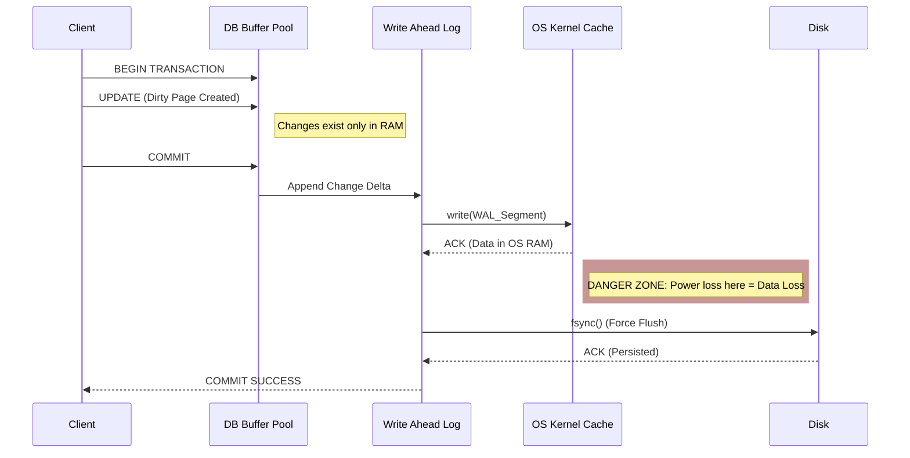

Protocol Loaded.

# 1. ACID & Transaction Management

### 1. Engineering Context

- **Enforcing State Integrity:** Guaranteeing partial updates are never persisted during system failures (e.g., power loss mid-transaction) or constraint violations.
- **Mitigating Concurrency Hazards:** Preventing race conditions such as Dirty Reads, Non-Repeatable Reads, and Phantom Reads without strictly serializing all throughput.
- **Durability vs. Latency Trade-off:** Managing the physical synchronization of volatile memory buffers to non-volatile storage (SSD/HDD) via Write-Ahead Logging (WAL) to survive crashes.

### 2. Internals & Architecture (The Deep Dive)

**Logical View:** A transaction is a unit of work. When `COMMIT` is issued, the database must ensure data is durable. If `ROLLBACK` is issued (or a crash occurs), the database must reverse all tentative changes.

**Physical View (OS/Disk Level):**

1.  **Buffer Pool Modification:** Updates are initially written to memory (Dirty Pages). Writing directly to the main data files (heap) is random I/O and too slow for real-time transactions.
2.  **Write-Ahead Log (WAL):** Changes are appended sequentially to the WAL. This is $O(1)$ sequential I/O, which is significantly faster than random writes.
3.  **OS Cache & Fsync:** The OS buffers writes in its own cache. To guarantee durability, the DB must issue an `fsync` system call to force the OS to flush buffers to physical disk. This bypasses the OS cache but incurs high latency.

**Costs:**

- **Disk I/O:** High on Checkpoints (flushing dirty pages); Optimized on Commit (Sequential WAL write).
- **Latency:** `fsync` operations block the `COMMIT` acknowledgement.
- **CPU:** Overhead for lock acquisition and MVCC version checking.

**Design Rationale:**
The architecture prioritizes **Sequential Write Performance** over **Random Write Performance**. Writing to the main data tables (B-Trees) requires rebalancing and random seeking ($O(\log n)$), which destroys write throughput. The WAL allows the database to persist the _intent_ sequentially ($O(1)$) and update the main data structures asynchronously (Checkpoints).

### 3. Configuration Dictionary

| Flag/Concept                      | Context        | Impact of Tuning                                                                                                                                                   |
| :-------------------------------- | :------------- | :----------------------------------------------------------------------------------------------------------------------------------------------------------------- |
| `SET TRANSACTION ISOLATION LEVEL` | Session/Global | Determines visibility of concurrent changes. Lower levels increase throughput but introduce read phenomena (Dirty Reads). Higher levels reduce concurrency.        |
| `fsync`                           | System Call    | **CRITICAL**. If disabled, the OS buffers writes. Commits are faster, but a crash/power loss results in data corruption/loss. Must be enabled for ACID durability. |
| `WAL` (Write Ahead Log)           | Storage Engine | The mechanism for durability. Disabling WAL (if supported) turns the DB into an in-memory store with no crash recovery.                                            |

### 4. Trade-off Matrix

| Isolation Level      | Mechanism                     | Dirty Read | Non-Repeatable Read | Phantom Read                | Performance Cost                              | Use Case                                                  |
| :------------------- | :---------------------------- | :--------- | :------------------ | :-------------------------- | :-------------------------------------------- | :-------------------------------------------------------- |
| **READ UNCOMMITTED** | No Locking/Raw Read           | **Yes**    | Yes                 | Yes                         | Low (Zero locking overhead)                   | Analytics where approximate data is acceptable.           |
| **READ COMMITTED**   | Read only committed data      | No         | **Yes**             | Yes                         | Medium (Standard locking)                     | General purpose. Default for Postgres/Oracle.             |
| **REPEATABLE READ**  | Snapshot / Shared Locks       | No         | No                  | **Yes** (Except Postgres\*) | High (Maintains long locks or MVCC snapshots) | Financial calcs requiring stable rows within transaction. |
| **SERIALIZABLE**     | Range Locks / Predicate Locks | No         | No                  | No                          | **Extreme** (Blocks concurrency)              | Strict inventory management; avoiding Write Skew.         |

_\*Note: Postgres implements Repeatable Read using Snapshot Isolation, which prevents Phantom Reads, unlike other standard implementations._

### 5. Production Hardening

- **Avoid Long-Running Transactions:** Long transactions hold locks and prevent the cleanup of Undo Logs (MySQL) or dead tuples (Postgres). This leads to bloat and performance degradation.
- **Handle Crash Recovery:** Upon restart after a crash, the database must replay the WAL to restore the state. If the WAL is large (due to infrequent checkpoints), startup time will be significant.
- **Eliminate Dirty Reads:** Never use `READ UNCOMMITTED` for business logic involving calculations (e.g., account balances). It reads data that may be rolled back, leading to permanent inconsistencies.
- **Lost Update Prevention:** In high-concurrency environments (e.g., ticket booking), `READ COMMITTED` is insufficient. Use `REPEATABLE READ`, explicit locking (`SELECT FOR UPDATE`), or Atomic Increments to prevent overwriting committed data from concurrent transactions.
- **Snapshot Isolation Awareness:** In databases like Postgres, `REPEATABLE READ` uses MVCC (Multi-Version Concurrency Control). This allows readers to not block writers, but requires vacuuming to clean up old row versions.
