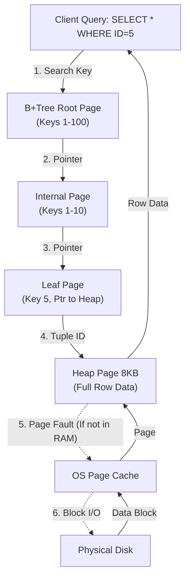

# 2. Database Internals & Storage

### 1. Engineering Context

- **Minimizing I/O Latency:** Disk I/O is the "currency" of databases; the goal is to fetch the maximum amount of relevant data in the fewest number of block reads.
- **Data Layout Optimization:** Deciding between Row-Stores (OLTP/Transactional) and Column-Stores (OLAP/Analytical) to align physical storage with query access patterns.
- **Index Efficiency:** Implementing B+Trees to maximize memory density of internal nodes and enable efficient range scans via linked leaf nodes.

### 2. Internals & Architecture (The Deep Dive)

**Physical View (Disk/OS Level):**
Data is not stored as "rows" but as **Pages** (Postgres default 8KB, MySQL default 16KB). A single I/O operation fetches an entire page. If a page contains 100 rows and you need 1, you still fetch the full 8KB (wasteful I/O).

**Logical View (Table Level):**

- **Heap:** An unordered collection of pages containing data rows. In Postgres, all tables are Heaps; indexes are secondary structures pointing to Heap Tuple IDs (TIDs).
- **Clustered Index (IOT):** The table _is_ the B+Tree. Leaf nodes contain the full row data. This enforces physical ordering. Default in MySQL InnoDB.

**B+Tree Traversal Architecture:**
Unlike B-Trees, B+Trees store **only keys** in internal nodes and **keys + values** in leaf nodes. This reduces the size of internal nodes, allowing more keys to fit in a memory page ($O(\log_m n)$), minimizing disk jumps. Leaf nodes are linked lists, enabling $O(1)$ sequential access for range queries.

**Costs:**

- **Disk I/O:** High on random access (Heap fetches from Secondary Index); Low on sequential scans (Clustered Index range scans).
- **CPU:** Decompression overhead in Column Stores.
- **Memory:** Buffer Pool thrashing when inserting random keys (UUIDv4) into Clustered Indexes.

**Design Rationale:**
B+Trees were chosen over B-Trees because internal nodes without data pointers are smaller. This allows the "hot" path (root/internal nodes) to reside entirely in RAM, significantly reducing I/O depth. Leaf node linking facilitates range scans ($O(N)$ after finding start), which B-Trees struggle with due to random traversal.

### 3. Configuration Dictionary

| Parameter                         | Database | Impact of Tuning                                                                                                                                                       |
| :-------------------------------- | :------- | :--------------------------------------------------------------------------------------------------------------------------------------------------------------------- |
| `block_size` / `innodb_page_size` | Global   | Size of a single I/O unit (8KB/16KB). Larger pages favor sequential throughput; smaller pages favor random access latency.                                             |
| `fillfactor`                      | Postgres | Percentage of page space to fill on insert (default 100%). reducing this (e.g., 90%) leaves space for HOT (Heap-Only Tuple) updates, preventing expensive page splits. |
| `random_page_cost`                | Postgres | Optimizer cost estimate for non-sequential disk seeks. Lowering this on SSDs encourages the planner to use Index Scans over Seq Scans.                                 |

### 4. Trade-off Matrix

| Mechanism                | Layout             | Read Efficiency                                                   | Write Efficiency                               | Compression                                    | Use Case                              |
| :----------------------- | :----------------- | :---------------------------------------------------------------- | :--------------------------------------------- | :--------------------------------------------- | :------------------------------------ |
| **Row Store**            | Contiguous Rows    | High for single entity retrieval (`SELECT * WHERE ID=X`).         | High (Append-only to heap).                    | Low (Heterogeneous data types).                | OLTP (Banking, User Profiles).        |
| **Column Store**         | Contiguous Columns | High for Aggregates (`SUM(salary)`). Fetches only needed columns. | Low (Must update multiple column files).       | High (Homogeneous data = Run-Length Encoding). | OLAP (Analytics, Data Warehousing).   |
| **Clustered Index**      | Sorted B+Tree      | **O(1)** + Scan for Range Queries. Data is pre-sorted.            | **Expensive** on random inserts (Page Splits). | Medium.                                        | MySQL Primary Keys, Time-series data. |
| **Heap (Non-Clustered)** | Append-only Pile   | Slower (Index Scan -> Random Heap Hop).                           | Fast (Append to end).                          | Low.                                           | Postgres Tables, Write-heavy logs.    |

### 5. Production Hardening

- **UUIDv4 as Primary Key Anti-Pattern:** Never use random UUIDs in a Clustered Index (MySQL default). Random insertion requires loading random pages into the Buffer Pool to check uniqueness/position, causing cache thrashing and expensive Page Splits ($O(N)$ data movement). Use sequential UUIDs (ULID/UUIDv7) or Integers.
- **Select \* Death Spiral:** In Column Stores, `SELECT *` forces the DB to seek and stitch together data from _every_ column file, destroying performance. In Row Stores, it fetches unnecessary data into memory, evicting useful cache pages.
- **Index Bloat:** Secondary indexes in MySQL point to the Primary Key. If your PK is large (e.g., UUID string), _every_ secondary index becomes massive, wasting disk and RAM.
- **Update amplification:** In partitioned tables, avoid updates that change the partition key. This forces a `DELETE` in the old partition and `INSERT` in the new one, doubling I/O cost.
