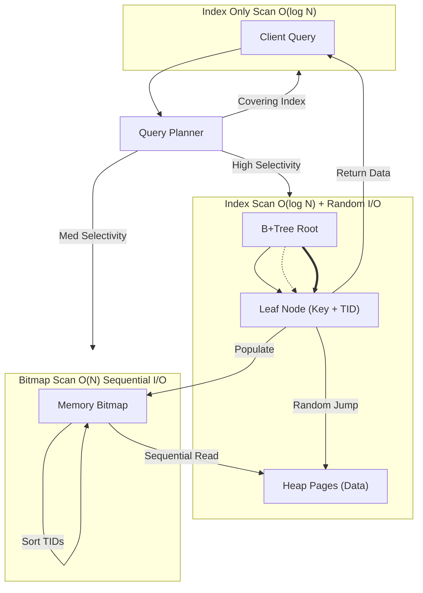

Protocol Loaded.

# 3. Database Indexing Strategies

### 1. Engineering Context

- **Minimizing I/O Depth:** Reducing the number of disk pages fetched to satisfy a query from $O(N)$ (Full Table Scan) to $O(\log N)$ (B-Tree traversal).
- **Transforming Access Patterns:** Converting expensive Random I/O (hopping between heap pages) into Sequential I/O using Bitmap Scans or Index-Only Scans.
- **Optimizing Storage/Memory Ratios:** Balancing index size against RAM availability to ensure hot paths (internal nodes) remain resident in the Buffer Pool.

### 2. Internals & Architecture (The Deep Dive)

**Logical View:** An index is a distinct data structure (usually a B+Tree) separate from the Table (Heap). The Index contains Keys and Tuple Identifiers (TIDs). The Heap contains the full row data.

**Physical View (Scan Types):**

1.  **Index Scan:** The database traverses the B-Tree to find a Row ID, then jumps to the Heap to fetch the full row. High **Random I/O** cost. Efficient for high-selectivity queries returning few rows.
2.  **Index Only Scan:** The database traverses the B-Tree and finds _all_ requested columns within the index leaf nodes (using Covered Indexes/`INCLUDE`). **Zero Heap Access**. Lowest Latency.
3.  **Bitmap Index Scan:** Used when the query selects too many rows for an Index Scan but too few for a Sequential Scan.
    - Step 1: Scan Index to find matching Row IDs.
    - Step 2: Build a bitmap in memory ($O(N)$ size of pages).
    - Step 3: Sort Row IDs by physical page location.
    - Step 4: Perform **Sequential I/O** on the Heap to fetch pages.
    - _Note:_ Can combine multiple indexes via bitmap `AND`/`OR` operations.

**Costs:**

- **Disk I/O:** High for Index Scan (Random Seek per row). Low for Index Only Scan.
- **CPU:** Higher during Bitmap Scan (building/sorting the bitmap).
- **Maintenance:** Every `INSERT`/`UPDATE` to the Heap requires $O(\log N)$ updates to _every_ active index, causing Write Amplification.

**Design Rationale:**
The B+Tree architecture was adopted because internal nodes only store Keys (not values), increasing the branching factor (M). This reduces tree height ($O(\log_m N)$), allowing the entire path to leaf nodes to often fit in RAM, minimizing disk seeks. Leaf nodes are linked lists, facilitating efficient range scans ($O(N)$) once the start key is found.

### 3. Configuration Dictionary

| Command / Flag              | Context          | Impact of Tuning                                                                                                                                               |
| :-------------------------- | :--------------- | :------------------------------------------------------------------------------------------------------------------------------------------------------------- |
| `CREATE INDEX CONCURRENTLY` | DDL Operation    | Builds the index without locking the table for writes. Slower and consumes more CPU/IO, but critical for production uptime. Requires two scans of the table.   |
| `INCLUDE (column)`          | Index Definition | Adds non-key columns to the index leaf nodes. Enables **Index Only Scans** by satisfying the query without visiting the Heap. Increases index size.            |
| `enable_seqscan`            | Postgres Config  | Debugging flag. Setting to `OFF` forces the planner to use indexes if possible. **DO NOT** disable in production as it cripples queries on small tables.       |
| `work_mem`                  | Postgres Config  | Memory allocated for operations like Bitmap builds. If too low, the bitmap becomes "lossy" (points to pages instead of rows), requiring re-checks on the Heap. |

### 4. Trade-off Matrix

| Strategy             | Mechanism               | Latency (Read)                       | Latency (Write)          | Storage Cost | Use Case                                          |
| :------------------- | :---------------------- | :----------------------------------- | :----------------------- | :----------- | :------------------------------------------------ |
| **Composite Index**  | Index on `(A, B)`       | Low for queries on `A` or `A AND B`. | High (larger structure). | High.        | Filtering by multiple correlated columns.         |
| **Multiple Indexes** | Index `A` + Index `B`   | Medium (Bitmap merge overhead).      | Medium (Update 2 trees). | Medium.      | Ad-hoc queries filtering on A or B independently. |
| **Covering Index**   | Index `A` + `INCLUDE B` | **Lowest** (No Heap access).         | High (Leaf node bloat).  | High.        | Read-heavy workloads fetching specific columns.   |
| **Sequential Scan**  | Linear Read             | High (Full Table I/O).               | Zero (No index maint).   | Zero.        | Reporting/ETL on >5-10% of table rows.            |

### 5. Production Hardening

- **Left-Prefix Rule Violation:** A composite index on `(A, B)` is useless for a query filtering only on `B`. The B-Tree is sorted by A first. Queries must match the leftmost prefix of the index definition.
- **Expression Blindness:** `WHERE year(date_col) = 2023` will **not** use an index on `date_col`. The database cannot look up the result of a function in a B-Tree built on raw values. Use **Expression Indexes** (e.g., `CREATE INDEX ON table (year(date_col))`).
- **Offset Pagination Death Spiral:** Avoid `OFFSET 100000 LIMIT 10`. The database must fetch 100,010 rows and discard 100,000. This is $O(N)$ work for $O(1)$ result. Use **Keyset Pagination** (`WHERE id > last_seen_id LIMIT 10`) to utilize the index for a seek ($O(\log N)$).
- **Cardinality Traps:** Indexing low-cardinality columns (e.g., "Gender" or "Boolean") is often wasteful. The planner will likely default to a Sequential Scan because reading 50% of the index + 50% of the Heap via random I/O is slower than a linear table read.
- **Blocking Operations:** Never run a standard `CREATE INDEX` on a live high-traffic table. It obtains an exclusive lock, blocking all writes. Always use `CREATE INDEX CONCURRENTLY`.
