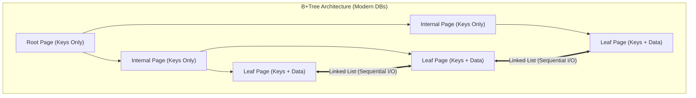

Protocol Loaded.

# 4. B-Tree vs B+Tree Internals

### 1. Engineering Context

- **Maximizing Fan-Out:** Optimizing the number of keys a single disk page can store to reduce the tree height ($O(\log_m N)$), thereby minimizing disk I/O operations per query.
- **Optimizing Range Scans:** Solving the "Random I/O Thrashing" problem inherent in standard B-Trees during range queries by utilizing linked leaf nodes for sequential access.
- **Memory Residency:** Ensuring the internal node structure (the navigation path) remains small enough to fit entirely in the database Buffer Pool (RAM), leaving disk I/O primarily for fetching leaf data.

### 2. Internals & Architecture (The Deep Dive)

**Logical View:**

- **B-Tree (Original):** Stores **Keys + Values** (Data Pointers or Row Data) in _all_ nodes (Root, Internal, and Leaf). If a search finds a key in an internal node, it stops and returns the value immediately.
- **B+Tree (Standard):** Stores **only Keys** in Internal/Root nodes (Routing mechanism). All **Values** are pushed to the Leaf Nodes. Leaf nodes are connected via a doubly-linked list.

**Physical View (Disk/Page Level):**
A Database "Node" is physically a **Page** (e.g., 8KB in Postgres, 16KB in InnoDB).

- In a **B-Tree**, if a row is large (e.g., contains a JSON blob), an internal node might only fit a few keys. This decreases the degree $M$ and increases tree height, forcing more disk seeks.
- In a **B+Tree**, internal nodes are tiny (just keys + page pointers). A single 8KB page can hold hundreds of keys. This keeps the tree shallow (usually depth 3-4 for terabytes of data).

**Costs:**

- **Range Query (B-Tree):** High Cost. Requires traversing up and down the tree for _every_ next value, causing Random I/O.
- **Range Query (B+Tree):** Low Cost. Find start key ($O(\log N)$) -> Scan Linked List ($O(K)$). Sequential I/O.
- **Memory:** B+Tree internal nodes consume significantly less RAM, increasing Cache Hit Ratio.

**Design Rationale:**
The B+Tree was adopted over the B-Tree because Database I/O is expensive. By stripping data from internal nodes, B+Trees maximize the branching factor. This ensures that the "hot" traversal path stays in RAM. The linked-list structure at the leaves aligns with physical disk read-ahead capabilities, making `ORDER BY` and `BETWEEN` queries significantly faster.

### 3. Configuration Dictionary

| Flag/Parameter         | Database | Impact of Tuning                                                                                                                                                         |
| :--------------------- | :------- | :----------------------------------------------------------------------------------------------------------------------------------------------------------------------- |
| `innodb_page_size`     | MySQL    | Default 16KB. Increasing this can improve throughput for sequential scans (B+Tree leaves) but may increase latency for random point lookups.                             |
| `fillfactor`           | Postgres | Default 100% for static tables, 90% for B-Trees. Reducing this (e.g., 50-70%) on heavy-write tables reduces **Page Splits** by leaving space in leaf nodes for new keys. |
| `effective_cache_size` | Postgres | Hints the optimizer on how much of the B+Tree is likely cached in RAM, influencing Index Scan vs. Seq Scan decisions.                                                    |

### 4. Trade-off Matrix

| Feature              | B-Tree (Original)     | B+Tree (Modern Standard)  | Performance Impact                                                                                    | Use Case                                 |
| :------------------- | :-------------------- | :------------------------ | :---------------------------------------------------------------------------------------------------- | :--------------------------------------- |
| **Point Lookup**     | $O(1)$ to $O(\log N)$ | Always $O(\log N)$        | B-Tree is faster _only_ if the key is in the root/internal node. B+Tree is more consistent.           | Key-Value stores where data is small.    |
| **Range Scan**       | Slow (Random I/O)     | **Fast** (Sequential I/O) | B+Tree traverses leaf pointers; B-Tree must retraverse from root/parent.                              | All relational DBs (SQL `BETWEEN`, `>`). |
| **Tree Height**      | Higher                | Lower                     | B+Tree fits more keys per page, reducing disk depth.                                                  | Large datasets (TB+).                    |
| **Space Efficiency** | Lower                 | Higher                    | B+Tree duplicates keys (internal + leaf), but pointer overhead is negligible compared to I/O savings. | General Purpose OLTP.                    |

### 5. Production Hardening

- **Random UUID Insert Performance Killer:** Do not use random UUIDs (v4) as a Primary Key in a Clustered B+Tree (MySQL InnoDB).
  - _Mechanism:_ Random inserts target random leaf pages. If a page is full, it triggers a **Page Split** ($O(N)$ copy cost). This destroys buffer pool locality (Thrashing) and fragments the index.
  - _Mitigation:_ Use sequential IDs (TSID/ULID) to fill pages sequentially.
- **Secondary Index Bloat (MySQL vs. Postgres):**
  - _MySQL:_ Secondary indexes point to the Primary Key. If the PK is a large string/UUID, _every_ secondary index becomes massive.
  - _Postgres:_ Secondary indexes point to the physical Tuple ID (TID). Updates to the row location (Heap) require updating _all_ indexes, leading to Write Amplification.
- **Deep Pagination with Offsets:** `OFFSET 10000` requires the engine to traverse the B+Tree leaf chain for 10,000 entries and discard them. This scans huge amounts of data for no reason. Use **Keyset Pagination** (Seek Method) to jump directly to the B+Tree key.
