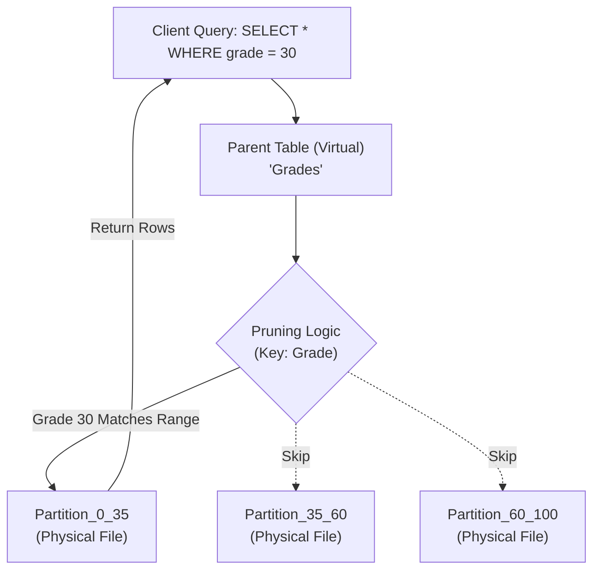

# 5. Database Partitioning

### 1. Engineering Context

- **Reducing Working Set Size:** Breaking monolithic B-Trees ($O(\log N)$) into smaller, manageable trees ($O(\log n)$) to ensure indexes fit in the Buffer Pool (RAM), preventing disk thrashing.
- **Optimizing Data Lifecycle Management:** Enabling efficient archival of time-series data. Dropping a partition is a file-system metadata operation ($O(1)$), whereas `DELETE FROM table WHERE date < X` is a row-by-row transactional nightmare ($O(N)$) that causes bloat and requires Vacuuming.
- **Improving Query Latency:** Minimizing I/O depth by restricting scans to relevant physical files via **Partition Pruning**, avoiding full table scans on massive datasets.

### 2. Internals & Architecture (The Deep Dive)

**Logical View:** The application interacts with a single "Parent Table" (e.g., `Grades`). This table is virtual and contains no data.
**Physical View:** Data resides in "Child Tables" (Partitions) which are distinct file structures on the disk (Heaps + Indexes).

**The Partitioning Mechanism:**

1.  **Ingestion:** The database engine analyzes the **Partition Key** (e.g., `grade` or `date`) of the incoming row.
2.  **Routing:** It maps the key to a specific child table range/hash bucket.
3.  **Storage:** The data is inserted physically into the child table's heap and indexes.
4.  **Retrieval (Pruning):** When a query includes the partition key in the `WHERE` clause, the planner explicitly skips scanning partitions that cannot contain the data.

**Costs:**

- **Disk I/O:** Drastically reduced for pruned queries. **Increased** for scatter-gather queries (scanning all partitions) due to opening multiple file descriptors.
- **CPU:** Slight overhead for tuple routing during insert. High cost during **Row Movement** (Update changing the partition key).
- **Maintenance:** Schema changes must propagate to all child tables.

**Design Rationale:**
Partitioning is chosen over a monolithic table to strictly manage **I/O patterns**. By ensuring that queries related to specific ranges (e.g., "Data from 2023") only touch specific files, the system avoids polluting the RAM cache with irrelevant data blocks.

### 3. Configuration Dictionary

| Flag/Command               | Database | Impact of Tuning                                                                                                                               |
| :------------------------- | :------- | :--------------------------------------------------------------------------------------------------------------------------------------------- |
| `PARTITION BY RANGE`       | DDL      | segments data based on a continuous range (e.g., Dates, IDs). Best for time-series.                                                            |
| `PARTITION BY LIST`        | DDL      | Segments data based on discrete values (e.g., Region: 'US', 'EU').                                                                             |
| `PARTITION BY HASH`        | DDL      | Distributes data uniformly using a modulus function. Useful when no natural range exists to prevent hotspots.                                  |
| `enable_partition_pruning` | Postgres | **CRITICAL**. Default `on`. If `off`, the planner scans _every_ partition regardless of the `WHERE` clause, negating all performance benefits. |
| `ATTACH PARTITION`         | DDL      | specific command to link a standalone table as a child of a partitioned table. Allows for near-instant data loading (ETL).                     |

### 4. Trade-off Matrix

| Mechanism                   | Query Latency                       | Maintenance           | Write Cost                | Flexibility | Use Case                                    |
| :-------------------------- | :---------------------------------- | :-------------------- | :------------------------ | :---------- | :------------------------------------------ |
| **Horizontal Partitioning** | **Low** (If Pruned) / High (If not) | Medium (Schema sync)  | Medium (Routing overhead) | Medium      | Time-series data, huge logs ($100M+$ rows). |
| **Vertical Partitioning**   | Low (Specific columns)              | High (Joins required) | Medium                    | Low         | Separating heavy BLOBs/Text from metadata.  |
| **Single Monolithic Table** | Medium (B-Tree depth)               | **Low**               | Low                       | High        | General OLTP under 10M rows.                |
| **Sharding**                | High (Network hops)                 | **Extreme**           | Low (Distributed)         | Low         | Massive scale exceeding single node limits. |

### 5. Production Hardening

- **The Row Movement Trap:** Updating a row's partition key (e.g., changing `grade` from 30 to 60) is **NOT** an in-place update. It is physically a `DELETE` from Partition A and an `INSERT` into Partition B. This doubles I/O, fires triggers twice, and causes index thrashing. **Avoid updating partition keys.**
- **Pruning Failures:** If your query does not include the partition key (e.g., `SELECT * FROM grades WHERE name = 'Hussein'`), the database must scan **all** partitions. This is often slower than scanning a single non-partitioned table due to the overhead of managing multiple open file handles and indexes.
- **Primary Key Constraints:** In many implementations (like Postgres), unique constraints (Primary Keys) must include the partition key. You cannot enforce a global unique ID across partitions without including the partition key in the constraint.
- **Constraint Exclusion:** Ensure `enable_partition_pruning` is strictly enabled. In older versions or specific configs, failing to set this results in "Partition Pruning Failure," where the DB scans petabytes of data for a kilobyte result.
