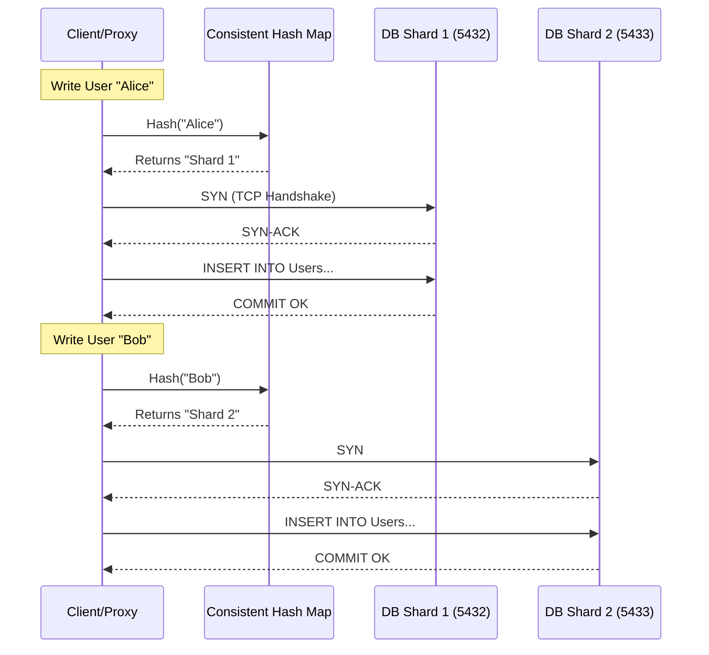

# 6. Database Sharding

### 1. Engineering Context

- **Surpassing Single-Node Write Throughput:** Overcoming the IOPS and CPU saturation limits of a single master node by distributing write operations across distinct physical servers.
- **Index Size Management:** Preventing B+Tree indexes from exceeding RAM capacity (Buffer Pool). By splitting data, indexes remain smaller and cache-resident, preventing disk thrashing.
- **Blast Radius Containment:** Isolating failures so that a crash or corruption in one shard affects only a subset of users (e.g., "European Users") rather than the entire global user base.

### 2. Internals & Architecture (The Deep Dive)

**Logical View:** The application perceives a single monolithic dataset (e.g., `All_Users`).
**Physical View (Network/Disk Level):** Data exists on completely isolated database instances (nodes), potentially in different data centers. The client or middleware MUST determine the routing logic before a TCP connection is even utilized for the query.

**The Sharding Mechanism (Consistent Hashing):**
Instead of `Key % N` (which breaks when `N` changes), use a Hash Ring.

1.  **Ring Generation:** Hash server identifiers (IPs/IDs) to points on a circle.
2.  **Key Mapping:** Hash the Sharding Key (e.g., UserID) to the same circle.
3.  **Routing:** Traverse the ring clockwise to find the first server node. This ensures that adding/removing a node only affects adjacent neighbors, not the entire cluster.

**Costs:**

- **Network:** increased latency if the client/proxy requires a lookup service to find the shard map.
- **Complexity:** Application logic must handle aggregation of results from multiple shards ($O(S)$ where $S$ is number of shards) for non-keyed queries.
- **Consistency:** Loss of ACID guarantees across shards. No atomic commits involving Shard A and Shard B.

**Design Rationale:**
Sharding is chosen _only_ after vertical scaling, read replicas, and caching layers are exhausted. It moves the complexity of routing and data distribution to the application (or middleware like Vitess) to achieve linear write scalability that a single ACID master cannot provide.

### 3. Configuration Dictionary

| Variable / Concept           | Context            | Impact of Tuning                                                                                                                                                                     |
| :--------------------------- | :----------------- | :----------------------------------------------------------------------------------------------------------------------------------------------------------------------------------- |
| `Shard Key`                  | Schema Design      | **CRITICAL**. Determines data distribution. A poor key (e.g., boolean or low cardinality) causes uneven distribution ("data hotspots"), rendering sharding useless.                  |
| `max_connections`            | Postgres/MySQL     | Must be tuned per shard. Since the app opens connections to _every_ shard, the total open file descriptors on the app server = $Connections \times Shards$. Use Pooling (PgBouncer). |
| `vbuckets` / `virtual_nodes` | Consistent Hashing | usage of virtual nodes in the hash ring improves distribution balance, preventing one physical node from owning too large an arc of the keyspace.                                    |

### 4. Trade-off Matrix

| Mechanism        | Write Scalability            | Read Scalability      | ACID Support                | Complexity  | Use Case                                                             |
| :--------------- | :--------------------------- | :-------------------- | :-------------------------- | :---------- | :------------------------------------------------------------------- |
| **Sharding**     | **Linear** ($O(N)$ nodes)    | High (Scatter-Gather) | **None** (Cross-shard)      | **Extreme** | Global scale apps (YouTube, Twitter) exceeding single master limits. |
| **Replication**  | Low (Single Master limit)    | High (Read Replicas)  | Full (Eventual on replicas) | Low         | Read-heavy workloads (Blogs, standard SaaS).                         |
| **Partitioning** | Low (Single Disk/IOPS limit) | Medium (Pruning)      | Full                        | Medium      | Managing large history tables (Time-series logs).                    |

### 5. Production Hardening

- **Cross-Shard Join Anti-Pattern:** DO NOT attempt to `JOIN` tables living on different shards. The latency is prohibitive ($O(N \times M)$ over network). Denormalize data so all data required for a query lives on the same shard.
- **The "Hot Shard" Problem:** If you shard by a key with high skew (e.g., "Celebrity" user with 100M followers), one shard will take 90% of the traffic while others sit idle. Use composite keys or application-level caching for hot keys.
- **Resharding Complexity:** changing the shard count (e.g., going from 10 to 20 shards) requires moving data. This is a massive, risky IO operation that often degrades performance during the migration. Avoid dynamic resharding; pre-provision heavily.
- **Transaction Boundaries:** Transactions are strictly local to a single shard. If a business action requires updating Shard A and Shard B, you must use eventual consistency (Sagas) or Two-Phase Commit (2PC) at the app level. **Avoid 2PC** if possible due to blocking latency.
- **Scatter-Gather Latency:** Queries without the shard key (e.g., "Find all users named 'John'") must query _all_ shards. The response time is determined by the _slowest_ shard.
