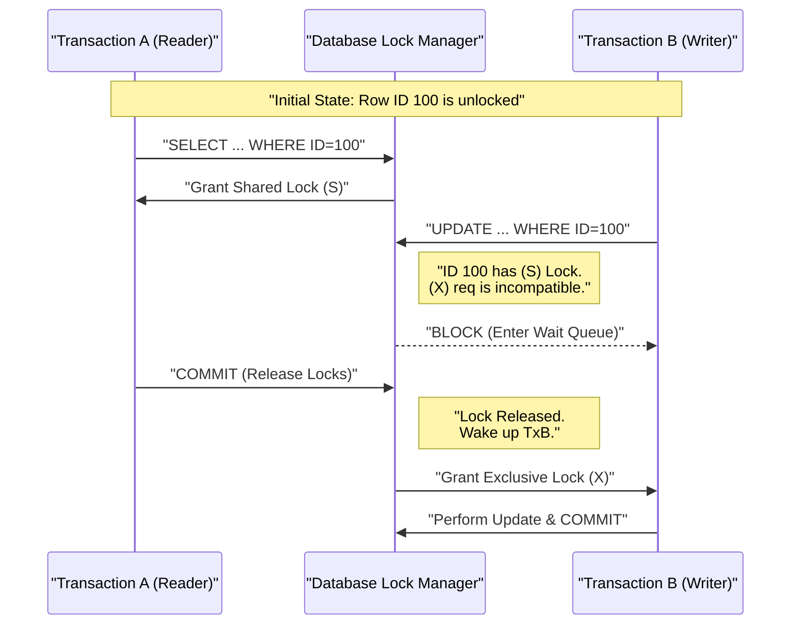

# 7. Concurrency Control

### 1. Engineering Context

- **Arbitrating Shared State Access:** Managing simultaneous read/write operations on identical memory or disk segments to prevent data corruption without enforcing global serialization (which destroys throughput).
- **Mitigating Race Conditions:** Solving "Lost Updates" and "Double Booking" scenarios where multiple transactions read a valid state and attempt to state-transition simultaneously based on obsolete data.
- **Balancing Isolation vs. Latency:** Selecting the appropriate locking strategy (Pessimistic vs. Optimistic) to define how much interference transactions can tolerate before blocking or failing.

### 2. Internals & Architecture (The Deep Dive)

**Logical View (Locking Disciplines):**

- **Shared Locks (S-Lock):** Used for reading. Multiple transactions can hold S-Locks on the same resource simultaneously. Prevents any transaction from acquiring an Exclusive Lock.
- **Exclusive Locks (X-Lock):** Used for writing/modifying. Only one transaction can hold an X-Lock. Blocks all other S-Locks and X-Locks. Requires the resource to be free of _any_ locks before acquisition.
- **Two-Phase Locking (2PL):** A protocol ensuring serializability.
  1.  **Expanding Phase:** Transaction acquires all necessary locks. No locks are released.
  2.  **Shrinking Phase:** Transaction releases locks (usually at Commit/Rollback). **Constraint:** Once a lock is released, no new locks can be acquired.

**Physical View (Implementation):**

- **Lock Manager:** An in-memory hash table tracking Lock Objects (Row ID -> Lock State). Maintaining these locks consumes memory proportional to the number of active locks.
- **Wait Queues:** When a transaction is blocked (e.g., requesting X-Lock on an S-Locked row), it enters a Wait Queue inside the OS/Kernel or DB Engine.
- **Deadlock Detector:** A background process (daemon) traversing the "Wait-For" graph looking for cycles ($T1 \to T2 \to T1$). If found, it kills the transaction that created the cycle (or the one with least work done) to break the deadlock.

**Costs:**

- **Memory:** High overhead for maintaining millions of row-level locks in RAM (e.g., Postgres does not escalate locks, increasing RAM usage per lock).
- **CPU:** Cycles spent on spinlocks, traversing Wait-For graphs (Deadlock detection), and managing the Lock Manager hash table.
- **Latency:** Blocked transactions sit idle (Wait Time), increasing tail latency.
- **Context Switches:** High during high-contention periods as threads sleep and wake up upon lock release.

**Design Rationale:**
Two-Phase Locking (2PL) via Pessimistic Concurrency Control was chosen to guarantee **Serializability** and prevent data anomalies. By holding locks until the end of the transaction, the database ensures that no other transaction sees intermediate, inconsistent states, preventing cascading rollbacks at the cost of blocking latency.

### 3. Configuration Dictionary

| Flag/Command                      | Context         | Impact of Tuning                                                                                                                                                                    |
| :-------------------------------- | :-------------- | :---------------------------------------------------------------------------------------------------------------------------------------------------------------------------------- |
| `SELECT ... FOR UPDATE`           | SQL Query       | **CRITICAL**. Explicitly acquires an Exclusive Lock on read. Prevents "Double Booking" by forcing concurrent transactions to wait until the first commits.                          |
| `lock_timeout`                    | System Config   | Sets maximum duration to wait for a lock. Default is often infinite. Set this to fail fast (e.g., 5s) rather than hanging threads indefinitely.                                     |
| `deadlock_timeout`                | Postgres Config | Time to wait before checking for deadlocks. Lower values detect deadlocks faster but burn CPU on the Wait-For graph traversal.                                                      |
| `SET TRANSACTION ISOLATION LEVEL` | Session         | Defines locking strictness. `SERIALIZABLE` locks ranges (Predicate Locks); `REPEATABLE READ` locks read rows; `READ COMMITTED` releases read locks immediately after the statement. |

### 4. Trade-off Matrix

| Mechanism               | Description                                  | Consistency                 | Concurrency (Throughput)       | Failure Mode               | Use Case                                                   |
| :---------------------- | :------------------------------------------- | :-------------------------- | :----------------------------- | :------------------------- | :--------------------------------------------------------- |
| **Pessimistic Locking** | Lock resources before use (`FOR UPDATE`).    | **High** (Guarantees order) | Low (High contention/blocking) | Deadlocks                  | Financial ledgers, Inventory management (Strict ordering). |
| **Optimistic Locking**  | No locks. Check version/timestamp at Commit. | Medium (Snapshots)          | **High** (No blocking)         | Rollback/Retry on conflict | High-read/Low-write apps, NoSQL systems.                   |
| **Serializable**        | Range locks / Strict 2PL.                    | Highest (No Phantoms)       | Lowest (Serial execution)      | Serialization Failure      | Medical records, Supply chain logistics.                   |
| **Read Committed**      | Short-lived Read locks.                      | Low (Non-repeatable reads)  | High                           | Race Conditions            | General web apps, Feeds/Comments.                          |

### 5. Production Hardening

- **The Double Booking Anti-Pattern:** Reading a value (`SELECT is_booked FROM seats`), checking it in the app logic, then updating (`UPDATE seats...`) leads to race conditions. Multiple users will see `is_booked=false` simultaneously. **Fix:** Use `SELECT ... FOR UPDATE` to lock the row during the read phase, strictly serializing the transaction.
- **Deadlock Prevention:**
  - **Consistent Ordering:** Always access resources in the same primary key order across all transactions. If Transaction A updates `(Row 1, Row 2)` and Transaction B updates `(Row 2, Row 1)`, a deadlock is mathematically guaranteed. Force both to update `(Row 1, Row 2)`.
  - **Keep Transactions Short:** Long transactions hold locks longer, drastically increasing the probability of lock contention and deadlocks.
- **Lock Escalation Awareness:** Be aware that some DBs (SQL Server) may promote row locks to page/table locks to save memory, killing concurrency. Postgres does not escalate locks but consumes shared memory per lock.
- **Zombie Transactions:** If a client crashes while holding an Exclusive Lock (before commit/rollback), that row remains inaccessible until the TCP connection times out or the session is killed. Configure application-level timeouts and TCP keepalives.
