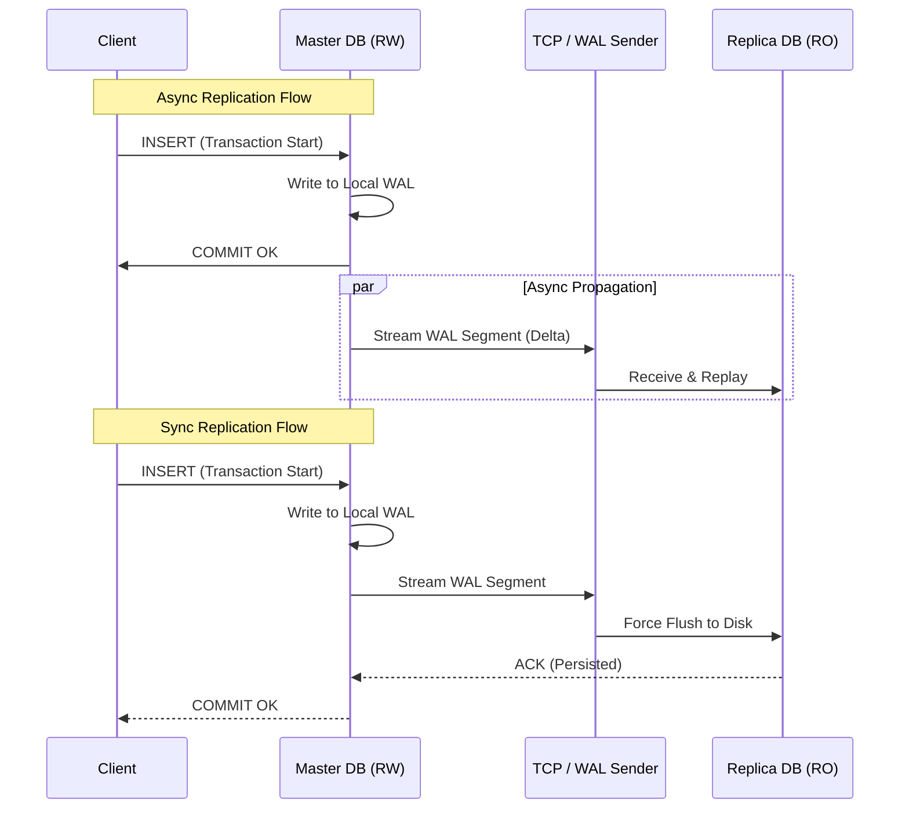

# 8. Database Replication

### 1. Engineering Context

- **Scaling Read Throughput:** Offloading read-heavy operations (e.g., analytics, reporting, user feeds) from the primary writer node to read-only replicas to prevent CPU/IO saturation on the master.
- **High Availability (HA) & Fault Tolerance:** Minimizing Mean Time To Recovery (MTTR) by maintaining warm standby nodes ready for failover in case of master hardware failure or corruption.
- **Geographic Latency Reduction:** Placing read replicas in specific geographic regions (e.g., US-East, EU-West) to serve local users with lower network latency (RTT), while writes incur the cost of propagation.,

### 2. Internals & Architecture (The Deep Dive)

**Logical View:**
The system consists of one **Master (RW)** node and $N$ **Standby (RO)** nodes. All writes (DML/DDL) must target the Master. The Master streams changes to Standbys.

**Physical View (WAL Streaming):**
Instead of replicating high-level SQL statements (which can be non-deterministic, e.g., `NOW()` or `RAND()`), modern databases (Postgres/MySQL) typically replicate the **Write-Ahead Log (WAL)**.

1.  **Commit on Master:** Client sends `INSERT`. Master writes to its local WAL buffer and flushes to disk.
2.  **WAL Sender:** A background process on the Master streams WAL segments (binary deltas) over a persistent TCP connection to the Standby.
3.  **WAL Receiver:** The Standby receives the segment, acknowledges receipt (if synchronous), and replays the binary changes to its own heap/indexes.

**Costs:**

- **Network:** Bandwidth consumption proportional to write volume.
- **Latency (Sync):** Write latency = Local Disk Fsync + Network RTT + Remote Disk Fsync + Ack.
- **Storage:** Duplication of full dataset across $N$ nodes.

**Design Rationale:**
**Single-Leader Replication** (Master-Standby) is chosen over **Multi-Master** for simplicity. Multi-master introduces complex conflict resolution scenarios (e.g., two nodes updating the same row simultaneously), whereas Single-Leader enforces a strict serial ordering of writes, guaranteeing consistency at the cost of write scalability limits.

### 3. Configuration Dictionary

| Parameter (Postgres context) | Default | Impact of Tuning                                                                                                                                                                                                              |
| :--------------------------- | :------ | :---------------------------------------------------------------------------------------------------------------------------------------------------------------------------------------------------------------------------- |
| `synchronous_commit`         | `on`    | **CRITICAL**. Controls durability vs. latency.  `on`: Waits for WAL flush on local + sync replicas.  `remote_write`: Waits for OS buffer on replica (faster, less durable).  `off`: Async (fastest, data loss risk). |
| `hot_standby`                | `on`    | Enables the replica to accept read-only queries while recovering/replaying WAL logs. If `off`, the replica is essentially a warm backup that cannot be queried.                                                               |
| `primary_conninfo`           | N/A     | Defines the connection string used by the Standby to connect to the Master. Includes host, port, and authentication for the replication user.                                                                                 |
| `synchronous_standby_names`  | Empty   | List of application names (replicas) that the Master _must_ wait for before confirming a commit. Enables Synchronous Replication.                                                                                             |

### 4. Trade-off Matrix

| Mechanism             | Write Latency                  | Read Consistency                                 | Data Durability (RPO)           | Throughput Impact       | Use Case                                         |
| :-------------------- | :----------------------------- | :----------------------------------------------- | :------------------------------ | :---------------------- | :----------------------------------------------- |
| **Async Replication** | Low (Master Local I/O)         | **Eventual** (Replica Lag)                       | Low (Data loss on Master crash) | High Write / High Read  | Social feeds, Logs, Non-financial data.          |
| **Sync Replication**  | High (Network RTT included)    | **Strong** (if reading from Master/Sync Replica) | **Zero Loss**                   | Lower Write / High Read | Financial transactions, Inventory counts.        |
| **Multi-Master**      | Medium (Local write + Bg sync) | Weak (Conflict prone)                            | Medium                          | High Write / High Read  | Geo-distributed writes where conflicts are rare. |

### 5. Production Hardening

- **The "Read Your Own Write" Trap:** In Async replication, a user may update their profile (Write to Master) and immediately reload the page (Read from Replica). Due to replication lag, they see old data.
  - _Mitigation:_ Sticky sessions (route user to Master for $X$ seconds after a write) or force critical reads to Master.
- **Split Brain:** If the network partitions, the Standby might promote itself to Master while the original Master is still active. Clients writing to both cause data divergence.
  - _Mitigation:_ Use consensus algorithms (e.g., Raft/Paxos) or fencing mechanisms (STONITH) to kill the old master.
- **Replication Slot Bloat:** If a Standby falls significantly behind or disconnects, the Master must retain old WAL segments preventing them from being recycled. This can fill up the Master's disk, causing a crash. Monitor WAL size strictly.
- **Cascading Failure (Sync):** If `synchronous_standby_names` is set and the replica goes down, the Master will hang on all commits, halting the entire system. Configure multiple sync standbys or timeout fallbacks.
