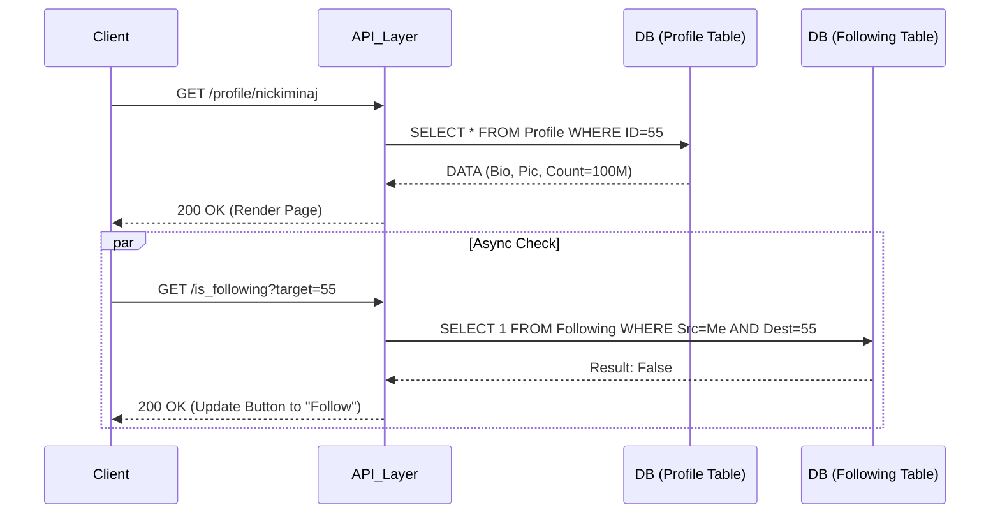
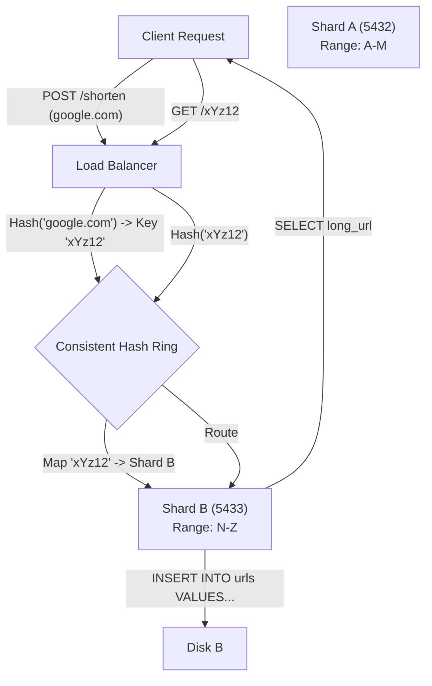

# 9. System Design Case Studies

### 1. Case Study A: The Social Graph (Twitter Implementation)

**Engineering Context**

- **Modeling Many-to-Many Relationships:** efficiently storing unidirectional relationships (User A follows User B) without creating join-bombs during high-traffic reads.
- **Latency vs. Consistency:** Balancing the requirement to show "Follower Counts" immediately versus the high cost of computing `COUNT(*)` on massive tables.
- **Write Amplification:** Handling "Celebrity" edge cases where a single action (Tweet) requires fan-out to millions of timelines.

**Internals & Architecture (The Deep Dive)**

**Logical View:**
The core entity is the `Following` table, linking `SourceID` (Follower) and `DestinationID` (Followee).

- **Naive Approach:** To get follower count, execute `SELECT COUNT(*) WHERE DestinationID = X`. This triggers a massive Index Scan ($O(N)$ where N is follower count).
- **Optimized Approach:** Denormalize counts onto the `Profile` table. Increment `Profile.following_count` atomically when a row is inserted into the `Following` table.

**Physical View (Disk/OS Level):**

1.  **Index Strategy:** The `Following` table requires a Composite B+Tree Index on `(SourceID, DestinationID)` for "Who am I following?" and `(DestinationID, SourceID)` for "Who follows me?".
2.  **Async Loading:** When rendering a profile, do **not** synchronously query "Am I following this user?". This doubles the I/O requirement for the initial page load. Fetch the Profile data first (1 Page Read), then fetch relationship status asynchronously.

**Costs:**

- **Disk I/O:** High on `INSERT` (updating B+Tree structure). Low on `SELECT` if indexes fit in RAM.
- **CPU:** Context switches increase during lock contention on high-volume profile updates (Celebrity gains 10k followers/sec).

**Design Rationale:**
Separating the "Profile View" from the "Relationship Check" reduces the critical path latency. If the `Following` table is under high write load (locking), the Profile page still renders instantly. Using denormalized counters avoids scanning millions of index leaf nodes for a simple number display.

---

### 2. Case Study B: High-Throughput URL Shortener

**Engineering Context**

- **Write Throughput Saturation:** Handling massive concurrent inserts of new URLs without locking the primary key index.
- **Collision Resolution:** Generating short codes (e.g., `bit.ly/3x9Z`) that are unique without expensive "Check-then-Insert" race conditions.
- **Predictability vs. Security:** Preventing enumeration attacks where attackers guess sequential IDs (`/1`, `/2`, `/3`).

**Internals & Architecture (The Deep Dive)**

**Strategy 1: Database Sequences (The Counter Approach)**

- **Mechanism:** Use Postgres `SERIAL` or Redis `INCR`. Map the Integer ID (Base10) to Base62 (a-z, A-Z, 0-9).
- **Physical:** Append-only B-Tree insertions.
- **Cost:** $O(1)$ insertion. Minimal Index fragmentation (Sequential Writes).
- **Security Risk:** Trivial to enumerate total URL count.

**Strategy 2: Hashing & Collision Handling (The Random Approach)**

- **Mechanism:** MD5/SHA256 the Long URL $\rightarrow$ Take first 7 bytes $\rightarrow$ Base62 Encode.
- **Collision:** If `INSERT` fails (Duplicate Key), salt the input and retry.
- **Physical:** Random insertions into B-Tree causing Page Splits ($O(N)$ data movement) and Buffer Pool thrashing.

**Sharding Strategy (Consistent Hashing):**
To scale beyond a single node, use a Hash Ring.

1.  **Hash(ShortURL)** maps to a specific Shard.
2.  **Write Path:** Client hashes LongURL $\rightarrow$ Determines Shard $\rightarrow$ Writes.
3.  **Read Path:** Client has ShortURL $\rightarrow$ Hashes to find Shard $\rightarrow$ SELECT from specific Shard.

**Design Rationale:**
Sharding is introduced only when a single Write Master cannot handle the IOPS. Consistent Hashing prevents a total cluster rebalance when adding a new node; only $K/N$ keys need to move (where $K$ is keys, $N$ is nodes).

### 3. Configuration Dictionary

| Parameter         | Context         | Impact of Tuning                                                                                                                                                                                                    |
| :---------------- | :-------------- | :------------------------------------------------------------------------------------------------------------------------------------------------------------------------------------------------------------------ |
| `max_connections` | Postgres Config | Defines connection limit. **Critical:** Use a Connection Pool (PgBouncer) to keep active DB connections low (e.g., 50-100) while serving thousands of HTTP requests. High values consume kernel RAM per connection. |
| `fillfactor`      | Index Config    | Set to <100% (e.g., 70%) for Random ID tables (Strategy 2) to reduce Page Splits on insert.                                                                                                                         |
| `wal_level`       | Replication     | Set to `replica` or `logical` to enable read-replicas for scaling URL redirection (Read-Heavy workload).                                                                                                            |

### 4. Trade-off Matrix: ID Generation Strategies

| Strategy                         | Write Latency                   | Index Health                    | Security                 | Scale Capability    | Use Case                                                                         |
| :------------------------------- | :------------------------------ | :------------------------------ | :----------------------- | :------------------ | :------------------------------------------------------------------------------- |
| **Auto-Increment (Serial)**      | **Lowest** (Sequential I/O)     | High (No fragmentation)         | Low (Predictable)        | Single Master Limit | Internal tools, non-public links.                                                |
| **Random Hash (MD5/UUID)**       | High (Random I/O + Retry loops) | Low (Page Splits/Fragmentation) | **High** (Unpredictable) | Shard-friendly      | Public URL shorteners (Bitly).                                                   |
| **Key Generation Service (KGS)** | Medium (Network hop to KGS)     | High                            | High                     | High                | Distributed systems requiring unique IDs without DB coordination (Snowflake ID). |

### 5. Production Hardening

- **The Double Booking/Race Condition:**
  - _Scenario:_ Two users try to claim custom alias "amazon" simultaneously.
  - _Fix:_ Do **not** `SELECT` then `INSERT`. Use `INSERT` with `ON CONFLICT DO NOTHING`. Rely on the Database constraints to enforce uniqueness atomically.
- **Thundering Herd on Cache Miss:**
  - _Scenario:_ A celebrity tweets a link. Millions click. Redis Cache misses. All requests hit the DB simultaneously.
  - _Fix:_ Implement **Request Coalescing** (Singleflight) in the application layer. Only _one_ DB query goes out; all other concurrent requests wait for that specific result.
- **Write Amplification with UUIDs:**
  - _Anti-Pattern:_ Using Random UUIDv4 as a Primary Key in MySQL (Clustered Index). This forces the engine to load random pages from disk to insert rows, destroying Buffer Pool efficiency. Use sequential IDs (ULID) or Postgres (Heap-based).
