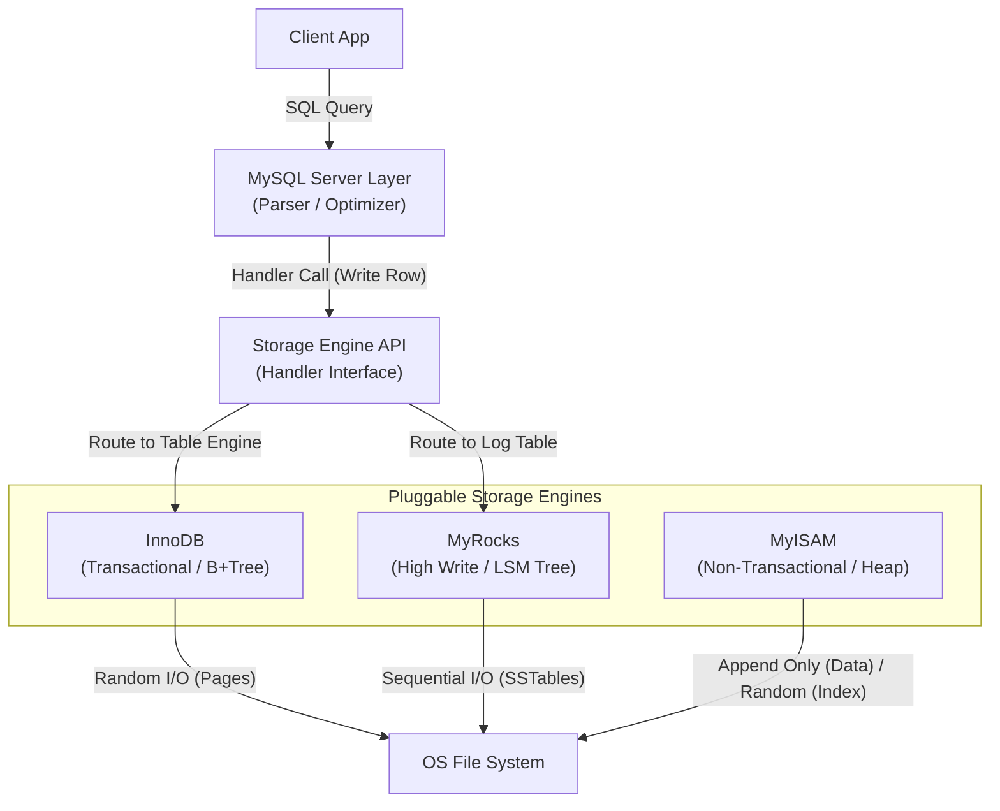

# 10. Pluggable Database Engines

### 1. Engineering Context

- **Decoupling Logic from Persistence:** Separating the database management system (networking, SQL parsing, optimization) from the underlying storage mechanism (disk I/O, file format) allows for workload-specific optimization.
- **Optimizing for Hardware Characteristics:** Selecting engines that align with physical storage properties (e.g., using Log-Structured Merge trees for SSDs to minimize random write amplification vs. B+Trees for spinning disks).
- **Workload Isolation:** Enabling a single database instance to handle heterogeneous workloads (e.g., a table for high-throughput logging using RocksDB alongside a table for transactional banking using InnoDB).

### 2. Internals & Architecture (The Deep Dive)

**Logical View:** The Database Management System (DBMS) acts as the frontend. It handles client TCP connections, authentication, and SQL parsing. It essentially says "Store this tuple" or "Fetch this row."

**Physical View (The Engine):** The Engine is a library invoked by the DBMS to manipulate bytes on the disk.

- **B-Tree Engines (InnoDB, MyISAM):** Organize data in fixed-size pages (e.g., 16KB). Updates are in-place modifications of these pages.
- **LSM Engines (RocksDB, LevelDB):** Organize data as a log. Writes go to an in-memory `MemTable`. When full, it flushes to disk as an immutable `SSTable`. Background compaction merges these files.

**Costs:**

- **B-Tree Costs:** High Random I/O on writes (Page Splits). Low CPU on reads.
- **LSM Costs:** Low I/O on writes (Append-only). High CPU during Compaction cycles. High Read Amplification (checking multiple SSTables).

**Design Rationale:**
MySQL adopted this architecture to allow users to "swizzle" the engine based on the table's purpose. You are not locked into a single data structure for the entire dataset. You can use MyISAM for read-heavy non-critical data, InnoDB for critical ACID compliance, and RocksDB for massive write-heavy logs.

### 3. Configuration Dictionary

| Parameter/Command          | Context | Impact of Tuning                                                                                                                   |
| :------------------------- | :------ | :--------------------------------------------------------------------------------------------------------------------------------- |
| `ENGINE=`                  | SQL DDL | Defined at table creation (e.g., `CREATE TABLE t1 (...) ENGINE=InnoDB`). Determines the underlying data structure and file format. |
| `show engines`             | System  | Lists available engines (InnoDB, MyISAM, CSV, Memory, etc.) and their support status.                                              |
| `innodb_buffer_pool_size`  | InnoDB  | **CRITICAL**. Defines how much RAM is dedicated to caching B+Tree pages. Ideally 70-80% of system RAM for a dedicated DB server.   |
| `rocksdb_block_cache_size` | MyRocks | Defines RAM for caching uncompressed data blocks in LSM trees. Tuning this balances read performance against memory usage.         |

### 4. Trade-off Matrix

| Engine      | Data Structure      | Transactional (ACID) | Locking Granularity | Write Cost                            | Read Cost                                  | Use Case                                                       |
| :---------- | :------------------ | :------------------- | :------------------ | :------------------------------------ | :----------------------------------------- | :------------------------------------------------------------- |
| **InnoDB**  | Clustered B+Tree    | **Yes**              | **Row Level**       | Medium (Random I/O on large datasets) | **Low** (Point lookup $O(\log N)$)         | General OLTP, Financial systems, Default choice.               |
| **MyISAM**  | Heap + B-Tree Index | No                   | **Table Level**     | Low (Append-only data)                | Low (Direct pointer)                       | Read-heavy/Legacy apps. **Anti-pattern** for high concurrency. |
| **RocksDB** | LSM Tree            | Yes                  | Row Level           | **Lowest** (Sequential I/O)           | Medium (Key might exist in multiple files) | High-volume write ingestion (Logs, IoT), SSD optimization.     |
| **CSV**     | Text File           | No                   | Table Level         | Low                                   | High (Parsing overhead)                    | Data interchange with Excel/Spreadsheets.                      |
| **Memory**  | Hash / B-Tree       | No (Volatile)        | Table Level         | Zero (No Disk I/O)                    | Lowest                                     | Temporary tables, ephemeral caches.                            |

### 5. Production Hardening

- **MyISAM Corruption Risk:** MyISAM tables are not crash-safe. A power loss during a write often corrupts the index, requiring a manual `REPAIR TABLE` operation which locks the table for hours on large datasets. **Avoid MyISAM for write-heavy workloads.**
- **The UUID Insert Killer (InnoDB):** Do not use random UUIDs as Primary Keys in InnoDB. Since InnoDB organizes the table as a B+Tree clustered by PK, random inserts cause massive page splitting and random I/O, destroying Buffer Pool efficiency. Use `MyRocks` (LSM) if you must use random write patterns, or use sequential IDs in InnoDB.
- **Table-Level Locking Bottlenecks:** MyISAM locks the _entire table_ for a write. Even if you update one row, no other connection can write (and often read) from that table. This creates a massive concurrency bottleneck. Use InnoDB for row-level locking.
- **SSD vs. HDD Selection:** B+Trees (InnoDB) degrade faster on HDDs due to random seek latency. LSM Trees (RocksDB) perform significantly better on SSDs but punish HDDs during compaction phases. align your engine choice with your physical storage hardware.
