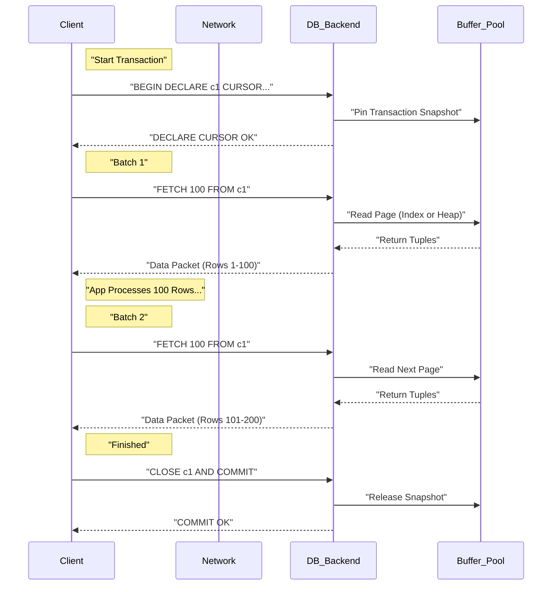

# 11. Database Cursors

### 1. Engineering Context

- **Preventing Client OOM:** Mitigating "Out of Memory" crashes when an application attempts to load a result set (e.g., 10M rows) that exceeds available heap space.
- **Optimizing Time-to-First-Byte (TTFB):** Enabling stream processing of results. The application can process the first 100 rows while the database continues calculating/retrieving the rest, rather than waiting for the full dataset compilation.
- **Network Bandwidth Control:** Smoothing network spikes by fetching data in chunks (batching) rather than saturating the TCP window with a massive single-shot bulk transfer.

### 2. Internals & Architecture (The Deep Dive)

**Logical View:**
A Cursor is a stateful pointer to a specific location within a query result set, living inside a database transaction.

- **Client-Side Cursor (Default):** The driver issues `SELECT *`. The DB pushes _all_ data to the client's network buffer immediately. The "cursor" logic is merely iterating over the local buffer.
- **Server-Side Cursor:** The client issues `DECLARE CURSOR`. The DB plans the query but halts execution (or pauses transmission). Data is only transmitted when the client issues `FETCH n`.

**Physical View (Postgres/Network Level):**

1.  **Initialization:** The client sends `BEGIN` followed by `DECLARE cursor_name CURSOR FOR query`. The DB creates a "Portal" object in memory (pinned to the session).
2.  **Retrieval:** The client sends `FETCH 1000 FROM cursor_name`.
3.  **Execution:** The DB engine executes the plan just enough to find the next 1000 tuples. If the plan involves a Sort, the DB might compute the sort fully (spilling to disk/`work_mem` if needed) before returning the first batch.
4.  **State Management:** The transaction remains open. In MVCC databases (Postgres), this holds a snapshot, preventing cleanup of old row versions (Dead Tuples) by processes like Vacuum.

**Costs:**

- **Network RTT:** **High**. Every batch requires a round trip (`FETCH` -> `Data`).
- **DB Memory:** **High**. The connection and transaction state must be maintained for the duration of the entire processing time.
- **Client Memory:** **Low**. Only needs to hold `batch_size` rows.
- **Disk I/O:** Varies. If using Index Scans, I/O is spread out. If using Sort/Hash Aggregates, temp files may be written to disk immediately.

**Design Rationale:**
Server-side cursors were designed to decouple **Query Execution** from **Result Transmission**. Without them, a 1GB result set requires 1GB of buffer space on the client (or kernel socket buffers), forcing the DB to block on network I/O if the client consumes data slowly. Cursors shift the backpressure handling to the application logic.

### 3. Configuration Dictionary

| Flag/Parameter            | Context            | Impact of Tuning                                                                                                                                                                |
| :------------------------ | :----------------- | :------------------------------------------------------------------------------------------------------------------------------------------------------------------------------ |
| `cursor_tuple_fraction`   | Postgres Config    | Default 0.1. Tells the optimizer to optimize for retrieving the first N rows (fast start) rather than the total result set. Helping it choose Index Scans over Seq Scans.       |
| `FETCH_SIZE` / `itersize` | Client Driver      | Defines the batch size (e.g., 2000). Too small = High Network RTT overhead. Too large = Client Memory pressure.                                                                 |
| `no_cursor_timeout`       | MongoDB            | Prevents the server from killing idle cursors (default 10 mins). Critical for long processing tasks.                                                                            |
| `holdable`                | Cursor Declaration | `DECLARE c1 CURSOR WITH HOLD`. Allows the cursor to remain open _after_ the transaction commits. **Expensive**: Forces DB to materialize the full result set into temp storage. |

### 4. Trade-off Matrix

| Mechanism              | Latency (First Byte)          | Latency (Total)         | Client Memory        | DB Resource Impact                            | Use Case                                                  |
| :--------------------- | :---------------------------- | :---------------------- | :------------------- | :-------------------------------------------- | :-------------------------------------------------------- |
| **Client-Side Cursor** | Medium (Wait for execution)   | **Low** (Bulk Transfer) | **High** (All rows)  | Low (Short transaction duration)              | Small/Medium datasets (<10k rows).                        |
| **Server-Side Cursor** | **Low** (Stream immediately)  | High (RTT per batch)    | **Low** (Batch size) | **High** (Long-running Tx + Snapshot holding) | ETL Jobs, Exporting 1M+ rows, Memory-constrained clients. |
| **Offset/Limit**       | High ($O(N)$ scan)            | Very High               | Low                  | High (Repeated re-scan of discarded rows)     | **Anti-Pattern** for deep paging. Web UI pagination only. |
| **Keyset Pagination**  | **Lowest** ($O(\log N)$ seek) | Low                     | Low                  | Low                                           | Stateless web pagination (Infinite Scroll).               |

### 5. Production Hardening

- **The "Vacuum Block" Anti-Pattern:** In MVCC databases (Postgres), an open transaction (required for a cursor) holds a snapshot. This prevents the auto-vacuum daemon from cleaning up _any_ dead tuples in the entire database updated after that snapshot started. **Result:** Massive table bloat and performance degradation during long ETL jobs.
  - _Fix:_ Commit frequently or use `WITH HOLD` (carefully) to detach from the transaction.
- **Cursor Leaks:** If the application crashes or exceptions occur without a `finally` block to `CLOSE` the cursor and `COMMIT/ROLLBACK`, the database connection remains stuck in a "Idle in transaction" state, holding locks and memory resources.
- **Network Timeouts:** If the client takes 5 minutes to process a batch, the database or intermediate firewalls/load balancers may kill the TCP connection due to inactivity (`idle_transaction_session_timeout`).
  - _Fix:_ Implement keep-alives or process data in a separate thread from the fetcher.
- **N+1 Fetch Problem:** Setting the fetch size to 1 (fetching row-by-row) generates network traffic orders of magnitude higher than the data size due to packet headers and protocol overhead. **Always batch.**
