# 12. NoSQL Architecture

### 1. Engineering Context

- **Decoupling Storage from API:** Moving away from the rigid "Table/Row" structure to allow the storage engine (e.g., LSM Trees, B-Trees) to treat data as raw bytes, while the API layer interprets format (JSON, Graph, Key-Value).
- **Scaling Horizontal Writes:** Overcoming the limitations of a single ACID master by distributing data partitions across multiple nodes (Sharding), accepting eventual consistency in exchange for high write throughput,.
- **Optimizing Data Locality:** Storing related data (aggregates) together in a single "Document" to minimize I/O depth, avoiding expensive JOINs required in normalized relational models.

### 2. Internals & Architecture (The Deep Dive)

**Logical View:**
NoSQL systems separate the **Data Format** (API layer) from the **Storage Engine**. The engine manages pages and bytes; the frontend manages Documents or Key-Values.

**Physical View (MongoDB Evolution Case Study):**

1.  **Legacy (MMAPv1):** Used linked lists and offset-based pointers. Required a **Global Lock** (or Collection Lock), severely limiting concurrency. Modifications to document size required rewriting files to new offsets,.
2.  **Modern (WiredTiger):** Introduced **Document-Level Locking** and Compression.
    - **Pre-5.3 (Non-Clustered):** Uses a **Hidden Index** mapping a 64-bit `RecordID` to the physical document. The visible `_id` index points to this `RecordID`.
    - **Cost:** Lookup requires **Two B-Tree Traversals** ($O(\log N) + O(\log N)$): One on `_id` index $\rightarrow$ get `RecordID` $\rightarrow$ search Hidden Index $\rightarrow$ get Document.
3.  **Clustered Collections (5.3+):** The table _is_ the B-Tree ordered by `_id`.
    - **Optimization:** Lookup is **One B-Tree Traversal** ($O(\log N)$). Data lives in the leaf nodes of the `_id` index.
    - **Cost:** Secondary indexes must point to the full `_id` (12 bytes) instead of the small `RecordID` (8 bytes), increasing storage size if `_id` is large,.

**Redis Internals (In-Memory Key-Value):**

- **Threading:** Single-threaded event loop for command execution to avoid context switching and locking overhead. Uses background threads for heavy I/O (persistence),.
- **Persistence:**
  - **RDB (Snapshotting):** Forks a process to dump memory to disk. Fast reads, potential data loss on crash.
  - **AOF (Append Only File):** Logs every write command sequentially. Slower replay, higher durability.

```mermaid
flowchart TD
    subgraph "MongoDB Lookup (Pre-5.3 / Non-Clustered)"
    Client1["Client"] --> ID_Index["_id Index (B-Tree)"]
    ID_Index -- "Found Key" --> RID["Returns RecordID (8 bytes)"]
    RID --> Hidden_Index["Hidden Index (B-Tree)"]
    Hidden_Index -- "Seek RecordID" --> Page["Data Page (Compressed)"]
    end

    subgraph "MongoDB Lookup (Clustered Collection)"
    Client2["Client"] --> Clustered_Index["_id Clustered Index"]
    Clustered_Index -- "Single Traversal" --> Data["Leaf Node (Full Document)"]
    end

    style Hidden_Index fill:#f9f,stroke:#333,stroke-width:2px
    style Clustered_Index fill:#bbf,stroke:#333,stroke-width:2px
```

**Design Rationale:**
The shift to **Clustered Collections** in document stores (like MongoDB) mimics the MySQL InnoDB architecture to reduce random I/O. By storing the document in the leaf node of the primary index, the engine eliminates the "double lookup" penalty, prioritizing read latency over the flexibility of heap-organized tables,.

### 3. Configuration Dictionary

| Parameter          | System    | Impact of Tuning                                                                                                                                                                  |
| :----------------- | :-------- | :-------------------------------------------------------------------------------------------------------------------------------------------------------------------------------- |
| `clusteredIndex`   | MongoDB   | **CRITICAL**. Boolean flag at collection creation. If `true`, organizes data by `_id`. Reduces lookup cost by 50% (Single B-Tree seek) but increases Secondary Index size,.       |
| `appendonly`       | Redis     | Default `no`. Set to `yes` to enable AOF persistence. Trades write latency (disk sync) for durability. If disabled, data exists only in RAM.                                      |
| `slab_chunk_max`   | Memcached | Controls memory page splitting. If items are slightly larger than the chunk size, significant memory fragmentation ("Slab Waste") occurs. Tune to match object size distribution. |
| `maxmemory-policy` | Redis     | Defines eviction strategy (e.g., `allkeys-lru`). If set incorrectly, writes fail when RAM is full. Essential for using Redis as a cache vs. a database.                           |

### 4. Trade-off Matrix

| Feature         | Relational (SQL)           | Document (NoSQL)                      | Key-Value (Redis/Memcached) | Use Case                                      |
| :-------------- | :------------------------- | :------------------------------------ | :-------------------------- | :-------------------------------------------- |
| **Schema**      | Rigid (Schema-on-Write)    | Flexible (Schema-on-Read)             | None (Blob/String)          | Rapid prototyping vs. Data Integrity.         |
| **Consistency** | Strong (ACID)              | Tunable/Eventual                      | Atomic (Per Key)            | Financial transactions vs. Social Feeds.      |
| **Joins**       | Efficient (Server-side)    | **Expensive/Manual** ($O(N)$ lookups) | Impossible                  | Analytics vs. High-throughput simple lookups. |
| **Write Cost**  | High (B-Tree splits + WAL) | Low (LSM Append-only / RAM)           | Lowest (RAM)                | System of Record vs. Ephemeral State/Cache.   |
| **Locking**     | Row-Level                  | Document-Level                        | Key-Level (Single Threaded) | High concurrency updates.                     |

### 5. Production Hardening

- **UUID as Primary Key Anti-Pattern:** In Clustered Collections (MongoDB/MySQL), using random UUIDs causes random insertions into the B-Tree. This triggers expensive **Page Splits** ($O(N)$ data movement) and destroys Buffer Pool locality. Use sequential IDs (ObjectId/ULID),.
- **The "Double Lookup" Penalty:** In non-clustered MongoDB collections, every query by `_id` performs two distinct B-Tree walks. For read-heavy workloads, migrate to Clustered Collections to halve the I/O operations.
- **Unbounded Keys:** In Redis/Memcached, avoid keys/values that grow indefinitely (e.g., appending to a list). Fetching a 10MB object blocks the single execution thread, causing a "Stop-the-World" latency spike for all other clients.
- **NoSQL "Joins":** Do not simulate Joins in the application layer by iterating a list of IDs and querying the DB for each (`N+1` problem). This saturates the network RTT. Denormalize data or use `$lookup` (with caution regarding memory limits).
- **Memcached Fragmentation:** Memcached allocates memory in fixed-size chunks (Slabs). Storing a 90-byte item in a 100-byte chunk wastes 10 bytes permanently. Monitor Slab Class statistics to tune chunk sizes to your data profile.
