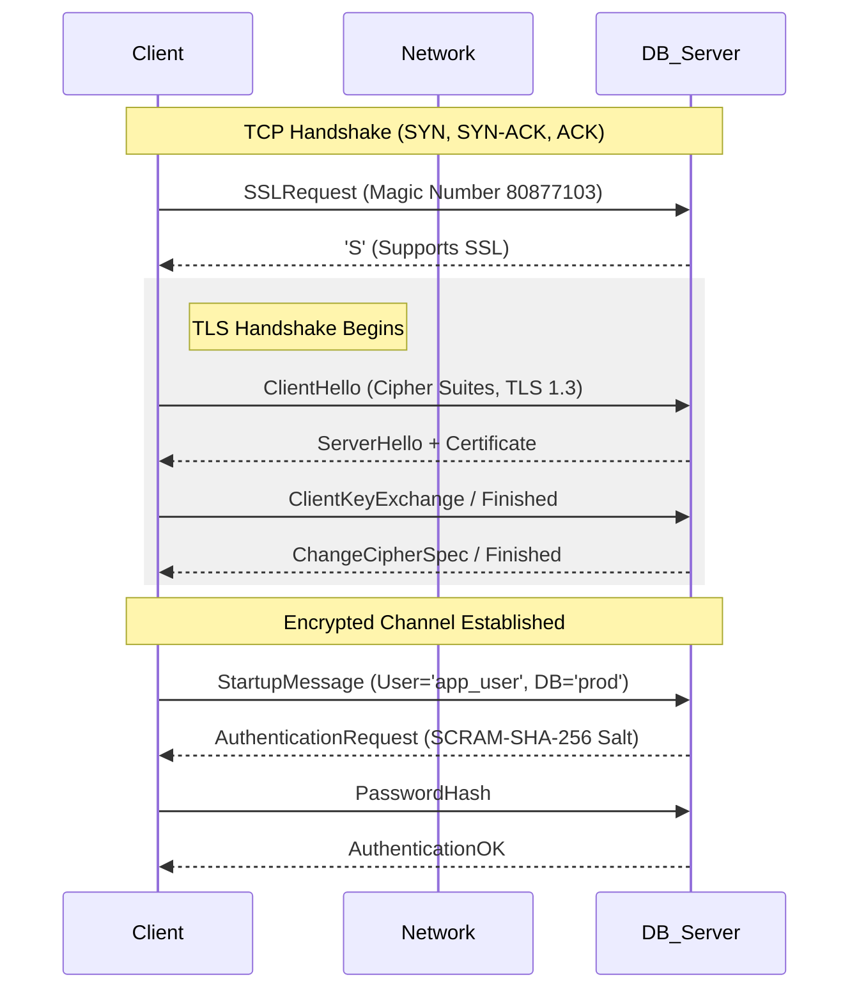

# 13. Database Security

### 1. Engineering Context

- **Mitigating Man-in-the-Middle (MITM) Attacks:** Transitioning database wire protocols from default plaintext TCP (vulnerable to packet sniffing via tools like Wireshark) to encrypted streams using TLS/SSL.
- **Enforcing Least Privilege Principle:** Preventing privilege escalation by decoupling Schema Owners (DDL) from Application Users (DML) to contain the blast radius of potential SQL injections.
- **Data-in-Use Protection:** Addressing the limitation where data must be decrypted in RAM to be processed, potentially exposing it to comprised servers or untrusted cloud providers (addressed via Homomorphic Encryption).

### 2. Internals & Architecture (The Deep Dive)

**Logical View (The TLS Upgrade):**
Most databases (Postgres, MySQL) operate on a "Request-Response" model over TCP. Security is often an add-on negotiation.

1.  **Cleartext Start:** The client initiates a TCP connection.
2.  **SSLRequest:** In Postgres, the client sends a special packet asking "Do you speak SSL?"
3.  **Negotiation:** The server responds with `S` (Yes) or `N` (No).
4.  **TLS Handshake:** If `S`, the standard TLS handshake ensues (ClientHello, ServerHello, Certificate Exchange, Key Generation).
5.  **Authentication:** Only _after_ the channel is encrypted does the database request credentials (e.g., MD5 or SCRAM hash).

**Physical View (Certificates & Keys):**
The database server requires a **Public Certificate** (`server.crt`) presented to clients and a **Private Key** (`server.key`) used to decrypt the pre-master secret. The file system permissions on the Private Key must be restricted (e.g., `chmod 600`), or the database process will refuse to start.

**Costs:**

- **Latency:** High during connection establishment (TCP Handshake + TLS Handshake + Auth RTT). Connection Pooling is mandatory to amortize this cost.
- **CPU:** Encryption/Decryption consumes cycles on both client and database server.
- **Network:** TLS records add slight byte overhead.

**Design Rationale:**
The "Upgrade" architecture was chosen to support legacy clients on the same port. The server waits for the client to request encryption. However, this allows for "SSL Stripping" attacks if the client is not configured to _require_ SSL (`sslmode=require/verify-full`).

**Homomorphic Encryption (Future State):**
Allows operations (addition, multiplication) on encrypted data _without_ decryption.

- **Mechanism:** Client encrypts $A$ and $B$. Server computes $A+B$ on ciphertexts. Result is encrypted $C$. Client decrypts $C$.
- **Current State:** Extremely slow (minutes for small searches), not production-ready, but eliminates the need for trusted servers.

### 3. Configuration Dictionary

| Flag/Parameter        | Database   | Impact of Tuning                                                                                                     |
| :-------------------- | :--------- | :------------------------------------------------------------------------------------------------------------------- |
| `ssl`                 | Postgres   | Default `off`. Set to `on` to enable TLS. Requires `ssl_cert_file` and `ssl_key_file` to be set.                     |
| `ssl_ciphers`         | Global     | Defines allowed encryption algorithms. Remove weak ciphers (e.g., RC4, MD5) to prevent downgrade attacks.            |
| `password_encryption` | Postgres   | Default `md5` (legacy). Switch to `scram-sha-256` for stronger hashing and protection against rainbow table attacks. |
| `PGSSLMODE`           | Client Lib | `require`: Fails if no SSL. `verify-full`: Verifies server hostname against cert (prevents MITM).                    |
| `-U 0` (UDP Disable)  | Memcached  | **CRITICAL**. Disable UDP listener to prevent Reflection DDoS attacks where the server is used as an amplifier.      |

### 4. Trade-off Matrix

| Mechanism          | Security Level           | Latency Impact              | Throughput Impact              | Use Case                                                                     |
| :----------------- | :----------------------- | :-------------------------- | :----------------------------- | :--------------------------------------------------------------------------- |
| **Plaintext**      | None (Sniffable)         | Lowest                      | Highest                        | Localhost dev; trusted VPC (Not recommended).                                |
| **TLS/SSL**        | High (Encrypted Transit) | Medium (Handshake overhead) | Low (Symmetric crypto is fast) | Standard Production Web Apps.                                                |
| **SCRAM-SHA-256**  | High (Auth)              | Medium (Compute intense)    | Negligible                     | Storing passwords; replacing MD5.                                            |
| **Homomorphic**    | **Extreme** (Zero Trust) | **Extreme** (Minutes/query) | **Extreme**                    | Highly sensitive data processing (Medical/Gov) where slowness is acceptable. |
| **Pool-per-Route** | High (Granular Access)   | Low (Pre-warmed)            | Medium (Resource usage)        | Microservices needing specific permissions (Read vs Write).                  |

### 5. Production Hardening

- **Superuser Anti-Pattern:** Never connect your application as `postgres` or `root`. If an SQL injection occurs, the attacker can `DROP TABLE` or `DROP DATABASE`. Create specific users (`app_read`, `app_write`) with minimum required `GRANT` permissions.
- **Sequence Permission Errors:** When creating a new user with `INSERT` permissions, you must also `GRANT USAGE` on the associated `SEQUENCE`. Otherwise, inserts will fail when trying to generate the next Primary Key ID.
- **SQL Injection via Concatenation:** Never concatenate strings for queries (e.g., `'SELECT * FROM users WHERE name = ' + userInput`). Always use **Parameterized Queries** (e.g., `$1`, `?`) so the database engine treats input as data, not executable code.
- **Memcached UDP Reflection:** By default, older Memcached versions listen on UDP. Attackers can spoof a target's IP, send a small request to Memcached, and Memcached will flood the target with a massive response (Amplification). **Disable UDP**.
- **Connection Pooling Security:** Instead of one pool with `admin` rights, maintain separate pools: one for `READ` (connected as read-only user) and one for `WRITE` (connected as write-user). This enforces security at the infrastructure level.
