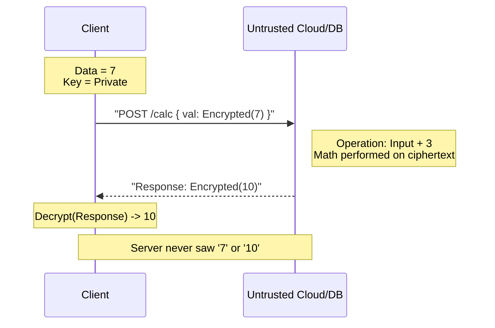

Protocol Loaded.

# 14. Homomorphic Encryption

### 1. Engineering Context

- **Closing the "Data-in-Use" Gap:** Traditional encryption protects data at Rest (Disk) and in Transit (TLS), but data must historically be decrypted in RAM to be processed (queried/analyzed), exposing it to memory dumps or comprised host operating systems.
- **Eliminating TLS Termination Risks:** Enabling Layer 7 proxies and load balancers to route traffic based on encrypted payloads without requiring possession of the server's Private Key, enforcing a true Zero-Trust architecture.
- **Untrusted Compute Environments:** allowing execution of analytics and queries on sensitive datasets (e.g., medical or financial records) hosted on public clouds without ever revealing the underlying plaintext to the cloud provider.

### 2. Internals & Architecture (The Deep Dive)

**Logical View:**
Homomorphic encryption allows arithmetic operations (addition, multiplication) to be performed directly on ciphertext.

1.  **Encryption:** Client encrypts value $A$ into $E(A)$.
2.  **Operation:** Server receives $E(A)$ and performs operation $+ 3$. The CPU executes complex polynomial math on the ciphertext.
3.  **Result:** The result is $E(A+3)$. The server does not know what $A$ is or what the result is.
4.  **Decryption:** Client receives $E(A+3)$ and decrypts it to get the integer result.

**Physical View (Compute Level):**
Unlike standard ALU operations which take nanoseconds ($O(1)$), homomorphic operations involve massive lattice-based cryptography overhead. A simple search on 48 rows can take ~2 minutes on standard hardware.

**Costs:**

- **CPU:** **Extreme**. Operations are orders of magnitude slower than plaintext arithmetic.
- **Memory:** Ciphertext expansion can increase data size significantly compared to plaintext.
- **Latency:** Currently prohibits synchronous/interactive user experiences (e.g., logging in or instant search).

**Design Rationale:**
This architecture is chosen specifically for **Privacy-Preserving Analytics**. It bypasses the need to trust the infrastructure provider. It is not designed for performance; it is designed for mathematical guarantees of privacy during computation.

### 3. Configuration Dictionary

_Note: As this is an emerging technology (e.g., IBM HElib), configurations refer to library/toolkit setups rather than standard DB flags._

| Parameter/Tool   | Context     | Impact of Tuning                                                                                                                                     |
| :--------------- | :---------- | :--------------------------------------------------------------------------------------------------------------------------------------------------- |
| `HE_LIBRARY`     | Build Time  | Selection of library (IBM HElib, Microsoft SEAL). Determines available schemes (BFV, CKKS) and performance characteristics.                          |
| `SECURITY_LEVEL` | Encryption  | Defines bit-strength (e.g., 128-bit). Higher security levels exponentially increase computation time and ciphertext size.                            |
| `Docker`         | Environment | Used to containerize the toolkit environments (e.g., CentOS/Ubuntu) to standardize the massive dependency chains required for compiling C++ HE code. |

### 4. Trade-off Matrix

| Mechanism                         | Privacy Level                 | Latency (Read/Write)        | Throughput | Infrastructure Trust                  | Use Case                                                |
| :-------------------------------- | :---------------------------- | :-------------------------- | :--------- | :------------------------------------ | :------------------------------------------------------ |
| **Standard Encryption (AES/TLS)** | Medium (Decrypted in RAM)     | Low (Hardware acceleration) | High       | **Required** (Must trust admin/cloud) | General Web Apps, standard OLTP.                        |
| **Homomorphic Encryption**        | **Highest** (Never decrypted) | **Extreme** (Minutes/query) | **Low**    | Zero Trust                            | Medical research, Voting systems, Outsourced analytics. |
| **Tokenization**                  | High (Refers to data)         | Low                         | High       | Medium (Token vault is SPF)           | PCI/DSS Credit Card storage.                            |

### 5. Production Hardening

- **Synchronous Path Anti-Pattern:** **DO NOT** use Homomorphic Encryption for user-facing, synchronous requests (e.g., "Search for my tweets"). A search over just 48 records can take minutes. This will timeout any standard HTTP client.
- **Asynchronous Workflows Only:** Use HE for background jobs where latency is irrelevant, such as generating daily trend reports or aggregating sensitive voting data.
- **Key Management Lifecycle:** The security of the entire system rests solely on the client-side keys. If the client key is lost, the data in the cloud is permanently irretrievable garbage.
- **Data Integrity:** Since the server cannot validate the data (it can't read it), you must implement client-side validation or append cryptographic signatures (HMAC) to ensure the server hasn't been fed malicious inputs to process.
