# The Database Engineering Handbook

_Compiled from the Hussein Nasser Course_

## Table of Contents

1. [ACID & Transaction Management](#1-acid--transaction-management)
2. [Database Internals & Storage](#2-database-internals--storage)
3. [Database Indexing Strategies](#3-database-indexing-strategies)
4. [B-Tree vs B+Tree Internals](#4-b-tree-vs-btree-internals)
5. [Database Partitioning](#5-database-partitioning)
6. [Database Sharding](#6-database-sharding)
7. [Concurrency Control](#7-concurrency-control)
8. [Database Replication](#8-database-replication)
9. [System Design Case Studies](#9-system-design-case-studies)
10. [Pluggable Database Engines](#10-pluggable-database-engines)
11. [Database Cursors](#11-database-cursors)
12. [NoSQL Architecture](#12-nosql-architecture)
13. [Database Security](#13-database-security)
14. [Homomorphic Encryption](#14-homomorphic-encryption)

---

# 1. ACID & Transaction Management

### 1. Engineering Context

- **Enforcing State Integrity:** Guaranteeing partial updates are never persisted during system failures (e.g., power loss mid-transaction) or constraint violations.
- **Mitigating Concurrency Hazards:** Preventing race conditions such as Dirty Reads, Non-Repeatable Reads, and Phantom Reads without strictly serializing all throughput.
- **Durability vs. Latency Trade-off:** Managing the physical synchronization of volatile memory buffers to non-volatile storage (SSD/HDD) via Write-Ahead Logging (WAL) to survive crashes.

### 2. Internals & Architecture (The Deep Dive)

**Logical View:** A transaction is a unit of work. When `COMMIT` is issued, the database must ensure data is durable. If `ROLLBACK` is issued (or a crash occurs), the database must reverse all tentative changes.

**Physical View (OS/Disk Level):**

1.  **Buffer Pool Modification:** Updates are initially written to memory (Dirty Pages). Writing directly to the main data files (heap) is random I/O and too slow for real-time transactions.
2.  **Write-Ahead Log (WAL):** Changes are appended sequentially to the WAL. This is $O(1)$ sequential I/O, which is significantly faster than random writes.
3.  **OS Cache & Fsync:** The OS buffers writes in its own cache. To guarantee durability, the DB must issue an `fsync` system call to force the OS to flush buffers to physical disk. This bypasses the OS cache but incurs high latency.

**Costs:**

- **Disk I/O:** High on Checkpoints (flushing dirty pages); Optimized on Commit (Sequential WAL write).
- **Latency:** `fsync` operations block the `COMMIT` acknowledgement.
- **CPU:** Overhead for lock acquisition and MVCC version checking.

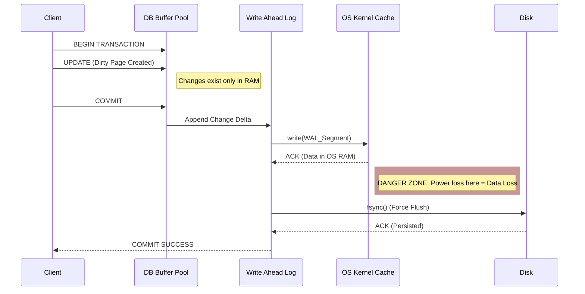

**Design Rationale:**
The architecture prioritizes **Sequential Write Performance** over **Random Write Performance**. Writing to the main data tables (B-Trees) requires rebalancing and random seeking ($O(\log n)$), which destroys write throughput. The WAL allows the database to persist the _intent_ sequentially ($O(1)$) and update the main data structures asynchronously (Checkpoints).

### 3. Configuration Dictionary

| Flag/Concept                      | Context        | Impact of Tuning                                                                                                                                                   |
| :-------------------------------- | :------------- | :----------------------------------------------------------------------------------------------------------------------------------------------------------------- |
| `SET TRANSACTION ISOLATION LEVEL` | Session/Global | Determines visibility of concurrent changes. Lower levels increase throughput but introduce read phenomena (Dirty Reads). Higher levels reduce concurrency.        |
| `fsync`                           | System Call    | **CRITICAL**. If disabled, the OS buffers writes. Commits are faster, but a crash/power loss results in data corruption/loss. Must be enabled for ACID durability. |
| `WAL` (Write Ahead Log)           | Storage Engine | The mechanism for durability. Disabling WAL (if supported) turns the DB into an in-memory store with no crash recovery.                                            |

### 4. Trade-off Matrix

| Isolation Level      | Mechanism                     | Dirty Read | Non-Repeatable Read | Phantom Read                | Performance Cost                              | Use Case                                                  |
| :------------------- | :---------------------------- | :--------- | :------------------ | :-------------------------- | :-------------------------------------------- | :-------------------------------------------------------- |
| **READ UNCOMMITTED** | No Locking/Raw Read           | **Yes**    | Yes                 | Yes                         | Low (Zero locking overhead)                   | Analytics where approximate data is acceptable.           |
| **READ COMMITTED**   | Read only committed data      | No         | **Yes**             | Yes                         | Medium (Standard locking)                     | General purpose. Default for Postgres/Oracle.             |
| **REPEATABLE READ**  | Snapshot / Shared Locks       | No         | No                  | **Yes** (Except Postgres\*) | High (Maintains long locks or MVCC snapshots) | Financial calcs requiring stable rows within transaction. |
| **SERIALIZABLE**     | Range Locks / Predicate Locks | No         | No                  | No                          | **Extreme** (Blocks concurrency)              | Strict inventory management; avoiding Write Skew.         |

_\*Note: Postgres implements Repeatable Read using Snapshot Isolation, which prevents Phantom Reads, unlike other standard implementations._

### 5. Production Hardening

- **Avoid Long-Running Transactions:** Long transactions hold locks and prevent the cleanup of Undo Logs (MySQL) or dead tuples (Postgres). This leads to bloat and performance degradation.
- **Handle Crash Recovery:** Upon restart after a crash, the database must replay the WAL to restore the state. If the WAL is large (due to infrequent checkpoints), startup time will be significant.
- **Eliminate Dirty Reads:** Never use `READ UNCOMMITTED` for business logic involving calculations (e.g., account balances). It reads data that may be rolled back, leading to permanent inconsistencies.
- **Lost Update Prevention:** In high-concurrency environments (e.g., ticket booking), `READ COMMITTED` is insufficient. Use `REPEATABLE READ`, explicit locking (`SELECT FOR UPDATE`), or Atomic Increments to prevent overwriting committed data from concurrent transactions.
- **Snapshot Isolation Awareness:** In databases like Postgres, `REPEATABLE READ` uses MVCC (Multi-Version Concurrency Control). This allows readers to not block writers, but requires vacuuming to clean up old row versions.

# 2. Database Internals & Storage

### 1. Engineering Context

- **Minimizing I/O Latency:** Disk I/O is the "currency" of databases; the goal is to fetch the maximum amount of relevant data in the fewest number of block reads.
- **Data Layout Optimization:** Deciding between Row-Stores (OLTP/Transactional) and Column-Stores (OLAP/Analytical) to align physical storage with query access patterns.
- **Index Efficiency:** Implementing B+Trees to maximize memory density of internal nodes and enable efficient range scans via linked leaf nodes.

### 2. Internals & Architecture (The Deep Dive)

**Physical View (Disk/OS Level):**
Data is not stored as "rows" but as **Pages** (Postgres default 8KB, MySQL default 16KB). A single I/O operation fetches an entire page. If a page contains 100 rows and you need 1, you still fetch the full 8KB (wasteful I/O).

**Logical View (Table Level):**

- **Heap:** An unordered collection of pages containing data rows. In Postgres, all tables are Heaps; indexes are secondary structures pointing to Heap Tuple IDs (TIDs).
- **Clustered Index (IOT):** The table _is_ the B+Tree. Leaf nodes contain the full row data. This enforces physical ordering. Default in MySQL InnoDB.

**B+Tree Traversal Architecture:**
Unlike B-Trees, B+Trees store **only keys** in internal nodes and **keys + values** in leaf nodes. This reduces the size of internal nodes, allowing more keys to fit in a memory page ($O(\log_m n)$), minimizing disk jumps. Leaf nodes are linked lists, enabling $O(1)$ sequential access for range queries.

**Costs:**

- **Disk I/O:** High on random access (Heap fetches from Secondary Index); Low on sequential scans (Clustered Index range scans).
- **CPU:** Decompression overhead in Column Stores.
- **Memory:** Buffer Pool thrashing when inserting random keys (UUIDv4) into Clustered Indexes.

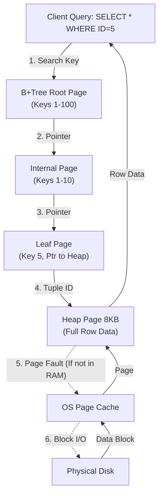

**Design Rationale:**
B+Trees were chosen over B-Trees because internal nodes without data pointers are smaller. This allows the "hot" path (root/internal nodes) to reside entirely in RAM, significantly reducing I/O depth. Leaf node linking facilitates range scans ($O(N)$ after finding start), which B-Trees struggle with due to random traversal.

### 3. Configuration Dictionary

| Parameter                         | Database | Impact of Tuning                                                                                                                                                       |
| :-------------------------------- | :------- | :--------------------------------------------------------------------------------------------------------------------------------------------------------------------- |
| `block_size` / `innodb_page_size` | Global   | Size of a single I/O unit (8KB/16KB). Larger pages favor sequential throughput; smaller pages favor random access latency.                                             |
| `fillfactor`                      | Postgres | Percentage of page space to fill on insert (default 100%). reducing this (e.g., 90%) leaves space for HOT (Heap-Only Tuple) updates, preventing expensive page splits. |
| `random_page_cost`                | Postgres | Optimizer cost estimate for non-sequential disk seeks. Lowering this on SSDs encourages the planner to use Index Scans over Seq Scans.                                 |

### 4. Trade-off Matrix

| Mechanism                | Layout             | Read Efficiency                                                   | Write Efficiency                               | Compression                                    | Use Case                              |
| :----------------------- | :----------------- | :---------------------------------------------------------------- | :--------------------------------------------- | :--------------------------------------------- | :------------------------------------ |
| **Row Store**            | Contiguous Rows    | High for single entity retrieval (`SELECT * WHERE ID=X`).         | High (Append-only to heap).                    | Low (Heterogeneous data types).                | OLTP (Banking, User Profiles).        |
| **Column Store**         | Contiguous Columns | High for Aggregates (`SUM(salary)`). Fetches only needed columns. | Low (Must update multiple column files).       | High (Homogeneous data = Run-Length Encoding). | OLAP (Analytics, Data Warehousing).   |
| **Clustered Index**      | Sorted B+Tree      | **O(1)** + Scan for Range Queries. Data is pre-sorted.            | **Expensive** on random inserts (Page Splits). | Medium.                                        | MySQL Primary Keys, Time-series data. |
| **Heap (Non-Clustered)** | Append-only Pile   | Slower (Index Scan -> Random Heap Hop).                           | Fast (Append to end).                          | Low.                                           | Postgres Tables, Write-heavy logs.    |

### 5. Production Hardening

- **UUIDv4 as Primary Key Anti-Pattern:** Never use random UUIDs in a Clustered Index (MySQL default). Random insertion requires loading random pages into the Buffer Pool to check uniqueness/position, causing cache thrashing and expensive Page Splits ($O(N)$ data movement). Use sequential UUIDs (ULID/UUIDv7) or Integers.
- **Select \* Death Spiral:** In Column Stores, `SELECT *` forces the DB to seek and stitch together data from _every_ column file, destroying performance. In Row Stores, it fetches unnecessary data into memory, evicting useful cache pages.
- **Index Bloat:** Secondary indexes in MySQL point to the Primary Key. If your PK is large (e.g., UUID string), _every_ secondary index becomes massive, wasting disk and RAM.
- **Update amplification:** In partitioned tables, avoid updates that change the partition key. This forces a `DELETE` in the old partition and `INSERT` in the new one, doubling I/O cost.
  Protocol Loaded.

# 3. Database Indexing Strategies

### 1. Engineering Context

- **Minimizing I/O Depth:** Reducing the number of disk pages fetched to satisfy a query from $O(N)$ (Full Table Scan) to $O(\log N)$ (B-Tree traversal).
- **Transforming Access Patterns:** Converting expensive Random I/O (hopping between heap pages) into Sequential I/O using Bitmap Scans or Index-Only Scans.
- **Optimizing Storage/Memory Ratios:** Balancing index size against RAM availability to ensure hot paths (internal nodes) remain resident in the Buffer Pool.

### 2. Internals & Architecture (The Deep Dive)

**Logical View:** An index is a distinct data structure (usually a B+Tree) separate from the Table (Heap). The Index contains Keys and Tuple Identifiers (TIDs). The Heap contains the full row data.

**Physical View (Scan Types):**

1.  **Index Scan:** The database traverses the B-Tree to find a Row ID, then jumps to the Heap to fetch the full row. High **Random I/O** cost. Efficient for high-selectivity queries returning few rows.
2.  **Index Only Scan:** The database traverses the B-Tree and finds _all_ requested columns within the index leaf nodes (using Covered Indexes/`INCLUDE`). **Zero Heap Access**. Lowest Latency.
3.  **Bitmap Index Scan:** Used when the query selects too many rows for an Index Scan but too few for a Sequential Scan.
    - Step 1: Scan Index to find matching Row IDs.
    - Step 2: Build a bitmap in memory ($O(N)$ size of pages).
    - Step 3: Sort Row IDs by physical page location.
    - Step 4: Perform **Sequential I/O** on the Heap to fetch pages.
    - _Note:_ Can combine multiple indexes via bitmap `AND`/`OR` operations.

**Costs:**

- **Disk I/O:** High for Index Scan (Random Seek per row). Low for Index Only Scan.
- **CPU:** Higher during Bitmap Scan (building/sorting the bitmap).
- **Maintenance:** Every `INSERT`/`UPDATE` to the Heap requires $O(\log N)$ updates to _every_ active index, causing Write Amplification.

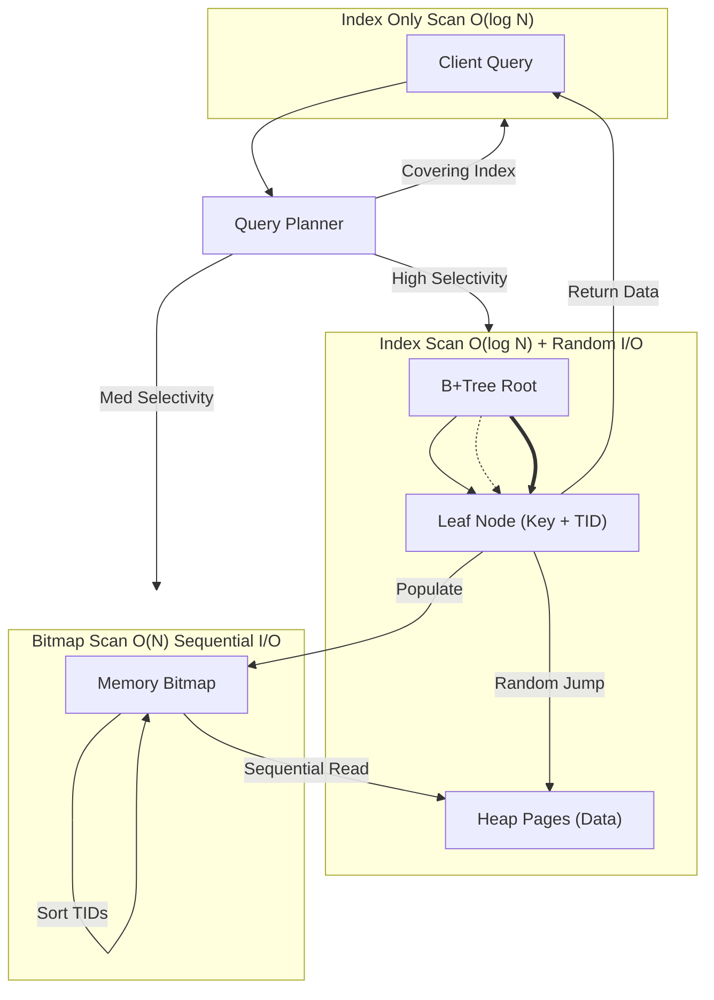

**Design Rationale:**
The B+Tree architecture was adopted because internal nodes only store Keys (not values), increasing the branching factor (M). This reduces tree height ($O(\log_m N)$), allowing the entire path to leaf nodes to often fit in RAM, minimizing disk seeks. Leaf nodes are linked lists, facilitating efficient range scans ($O(N)$) once the start key is found.

### 3. Configuration Dictionary

| Command / Flag              | Context          | Impact of Tuning                                                                                                                                               |
| :-------------------------- | :--------------- | :------------------------------------------------------------------------------------------------------------------------------------------------------------- |
| `CREATE INDEX CONCURRENTLY` | DDL Operation    | Builds the index without locking the table for writes. Slower and consumes more CPU/IO, but critical for production uptime. Requires two scans of the table.   |
| `INCLUDE (column)`          | Index Definition | Adds non-key columns to the index leaf nodes. Enables **Index Only Scans** by satisfying the query without visiting the Heap. Increases index size.            |
| `enable_seqscan`            | Postgres Config  | Debugging flag. Setting to `OFF` forces the planner to use indexes if possible. **DO NOT** disable in production as it cripples queries on small tables.       |
| `work_mem`                  | Postgres Config  | Memory allocated for operations like Bitmap builds. If too low, the bitmap becomes "lossy" (points to pages instead of rows), requiring re-checks on the Heap. |

### 4. Trade-off Matrix

| Strategy             | Mechanism               | Latency (Read)                       | Latency (Write)          | Storage Cost | Use Case                                          |
| :------------------- | :---------------------- | :----------------------------------- | :----------------------- | :----------- | :------------------------------------------------ |
| **Composite Index**  | Index on `(A, B)`       | Low for queries on `A` or `A AND B`. | High (larger structure). | High.        | Filtering by multiple correlated columns.         |
| **Multiple Indexes** | Index `A` + Index `B`   | Medium (Bitmap merge overhead).      | Medium (Update 2 trees). | Medium.      | Ad-hoc queries filtering on A or B independently. |
| **Covering Index**   | Index `A` + `INCLUDE B` | **Lowest** (No Heap access).         | High (Leaf node bloat).  | High.        | Read-heavy workloads fetching specific columns.   |
| **Sequential Scan**  | Linear Read             | High (Full Table I/O).               | Zero (No index maint).   | Zero.        | Reporting/ETL on >5-10% of table rows.            |

### 5. Production Hardening

- **Left-Prefix Rule Violation:** A composite index on `(A, B)` is useless for a query filtering only on `B`. The B-Tree is sorted by A first. Queries must match the leftmost prefix of the index definition.
- **Expression Blindness:** `WHERE year(date_col) = 2023` will **not** use an index on `date_col`. The database cannot look up the result of a function in a B-Tree built on raw values. Use **Expression Indexes** (e.g., `CREATE INDEX ON table (year(date_col))`).
- **Offset Pagination Death Spiral:** Avoid `OFFSET 100000 LIMIT 10`. The database must fetch 100,010 rows and discard 100,000. This is $O(N)$ work for $O(1)$ result. Use **Keyset Pagination** (`WHERE id > last_seen_id LIMIT 10`) to utilize the index for a seek ($O(\log N)$).
- **Cardinality Traps:** Indexing low-cardinality columns (e.g., "Gender" or "Boolean") is often wasteful. The planner will likely default to a Sequential Scan because reading 50% of the index + 50% of the Heap via random I/O is slower than a linear table read.
- **Blocking Operations:** Never run a standard `CREATE INDEX` on a live high-traffic table. It obtains an exclusive lock, blocking all writes. Always use `CREATE INDEX CONCURRENTLY`.
  Protocol Loaded.

# 4. B-Tree vs B+Tree Internals

### 1. Engineering Context

- **Maximizing Fan-Out:** Optimizing the number of keys a single disk page can store to reduce the tree height ($O(\log_m N)$), thereby minimizing disk I/O operations per query.
- **Optimizing Range Scans:** Solving the "Random I/O Thrashing" problem inherent in standard B-Trees during range queries by utilizing linked leaf nodes for sequential access.
- **Memory Residency:** Ensuring the internal node structure (the navigation path) remains small enough to fit entirely in the database Buffer Pool (RAM), leaving disk I/O primarily for fetching leaf data.

### 2. Internals & Architecture (The Deep Dive)

**Logical View:**

- **B-Tree (Original):** Stores **Keys + Values** (Data Pointers or Row Data) in _all_ nodes (Root, Internal, and Leaf). If a search finds a key in an internal node, it stops and returns the value immediately.
- **B+Tree (Standard):** Stores **only Keys** in Internal/Root nodes (Routing mechanism). All **Values** are pushed to the Leaf Nodes. Leaf nodes are connected via a doubly-linked list.

**Physical View (Disk/Page Level):**
A Database "Node" is physically a **Page** (e.g., 8KB in Postgres, 16KB in InnoDB).

- In a **B-Tree**, if a row is large (e.g., contains a JSON blob), an internal node might only fit a few keys. This decreases the degree $M$ and increases tree height, forcing more disk seeks.
- In a **B+Tree**, internal nodes are tiny (just keys + page pointers). A single 8KB page can hold hundreds of keys. This keeps the tree shallow (usually depth 3-4 for terabytes of data).

**Costs:**

- **Range Query (B-Tree):** High Cost. Requires traversing up and down the tree for _every_ next value, causing Random I/O.
- **Range Query (B+Tree):** Low Cost. Find start key ($O(\log N)$) -> Scan Linked List ($O(K)$). Sequential I/O.
- **Memory:** B+Tree internal nodes consume significantly less RAM, increasing Cache Hit Ratio.

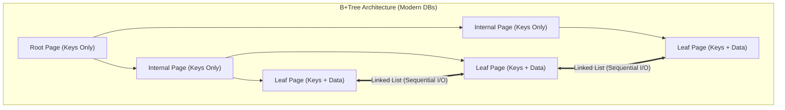

**Design Rationale:**
The B+Tree was adopted over the B-Tree because Database I/O is expensive. By stripping data from internal nodes, B+Trees maximize the branching factor. This ensures that the "hot" traversal path stays in RAM. The linked-list structure at the leaves aligns with physical disk read-ahead capabilities, making `ORDER BY` and `BETWEEN` queries significantly faster.

### 3. Configuration Dictionary

| Flag/Parameter         | Database | Impact of Tuning                                                                                                                                                         |
| :--------------------- | :------- | :----------------------------------------------------------------------------------------------------------------------------------------------------------------------- |
| `innodb_page_size`     | MySQL    | Default 16KB. Increasing this can improve throughput for sequential scans (B+Tree leaves) but may increase latency for random point lookups.                             |
| `fillfactor`           | Postgres | Default 100% for static tables, 90% for B-Trees. Reducing this (e.g., 50-70%) on heavy-write tables reduces **Page Splits** by leaving space in leaf nodes for new keys. |
| `effective_cache_size` | Postgres | Hints the optimizer on how much of the B+Tree is likely cached in RAM, influencing Index Scan vs. Seq Scan decisions.                                                    |

### 4. Trade-off Matrix

| Feature              | B-Tree (Original)     | B+Tree (Modern Standard)  | Performance Impact                                                                                    | Use Case                                 |
| :------------------- | :-------------------- | :------------------------ | :---------------------------------------------------------------------------------------------------- | :--------------------------------------- |
| **Point Lookup**     | $O(1)$ to $O(\log N)$ | Always $O(\log N)$        | B-Tree is faster _only_ if the key is in the root/internal node. B+Tree is more consistent.           | Key-Value stores where data is small.    |
| **Range Scan**       | Slow (Random I/O)     | **Fast** (Sequential I/O) | B+Tree traverses leaf pointers; B-Tree must retraverse from root/parent.                              | All relational DBs (SQL `BETWEEN`, `>`). |
| **Tree Height**      | Higher                | Lower                     | B+Tree fits more keys per page, reducing disk depth.                                                  | Large datasets (TB+).                    |
| **Space Efficiency** | Lower                 | Higher                    | B+Tree duplicates keys (internal + leaf), but pointer overhead is negligible compared to I/O savings. | General Purpose OLTP.                    |

### 5. Production Hardening

- **Random UUID Insert Performance Killer:** Do not use random UUIDs (v4) as a Primary Key in a Clustered B+Tree (MySQL InnoDB).
  - _Mechanism:_ Random inserts target random leaf pages. If a page is full, it triggers a **Page Split** ($O(N)$ copy cost). This destroys buffer pool locality (Thrashing) and fragments the index.
  - _Mitigation:_ Use sequential IDs (TSID/ULID) to fill pages sequentially.
- **Secondary Index Bloat (MySQL vs. Postgres):**
  - _MySQL:_ Secondary indexes point to the Primary Key. If the PK is a large string/UUID, _every_ secondary index becomes massive.
  - _Postgres:_ Secondary indexes point to the physical Tuple ID (TID). Updates to the row location (Heap) require updating _all_ indexes, leading to Write Amplification.
- **Deep Pagination with Offsets:** `OFFSET 10000` requires the engine to traverse the B+Tree leaf chain for 10,000 entries and discard them. This scans huge amounts of data for no reason. Use **Keyset Pagination** (Seek Method) to jump directly to the B+Tree key.

# 5. Database Partitioning

### 1. Engineering Context

- **Reducing Working Set Size:** Breaking monolithic B-Trees ($O(\log N)$) into smaller, manageable trees ($O(\log n)$) to ensure indexes fit in the Buffer Pool (RAM), preventing disk thrashing.
- **Optimizing Data Lifecycle Management:** Enabling efficient archival of time-series data. Dropping a partition is a file-system metadata operation ($O(1)$), whereas `DELETE FROM table WHERE date < X` is a row-by-row transactional nightmare ($O(N)$) that causes bloat and requires Vacuuming.
- **Improving Query Latency:** Minimizing I/O depth by restricting scans to relevant physical files via **Partition Pruning**, avoiding full table scans on massive datasets.

### 2. Internals & Architecture (The Deep Dive)

**Logical View:** The application interacts with a single "Parent Table" (e.g., `Grades`). This table is virtual and contains no data.
**Physical View:** Data resides in "Child Tables" (Partitions) which are distinct file structures on the disk (Heaps + Indexes).

**The Partitioning Mechanism:**

1.  **Ingestion:** The database engine analyzes the **Partition Key** (e.g., `grade` or `date`) of the incoming row.
2.  **Routing:** It maps the key to a specific child table range/hash bucket.
3.  **Storage:** The data is inserted physically into the child table's heap and indexes.
4.  **Retrieval (Pruning):** When a query includes the partition key in the `WHERE` clause, the planner explicitly skips scanning partitions that cannot contain the data.

**Costs:**

- **Disk I/O:** Drastically reduced for pruned queries. **Increased** for scatter-gather queries (scanning all partitions) due to opening multiple file descriptors.
- **CPU:** Slight overhead for tuple routing during insert. High cost during **Row Movement** (Update changing the partition key).
- **Maintenance:** Schema changes must propagate to all child tables.

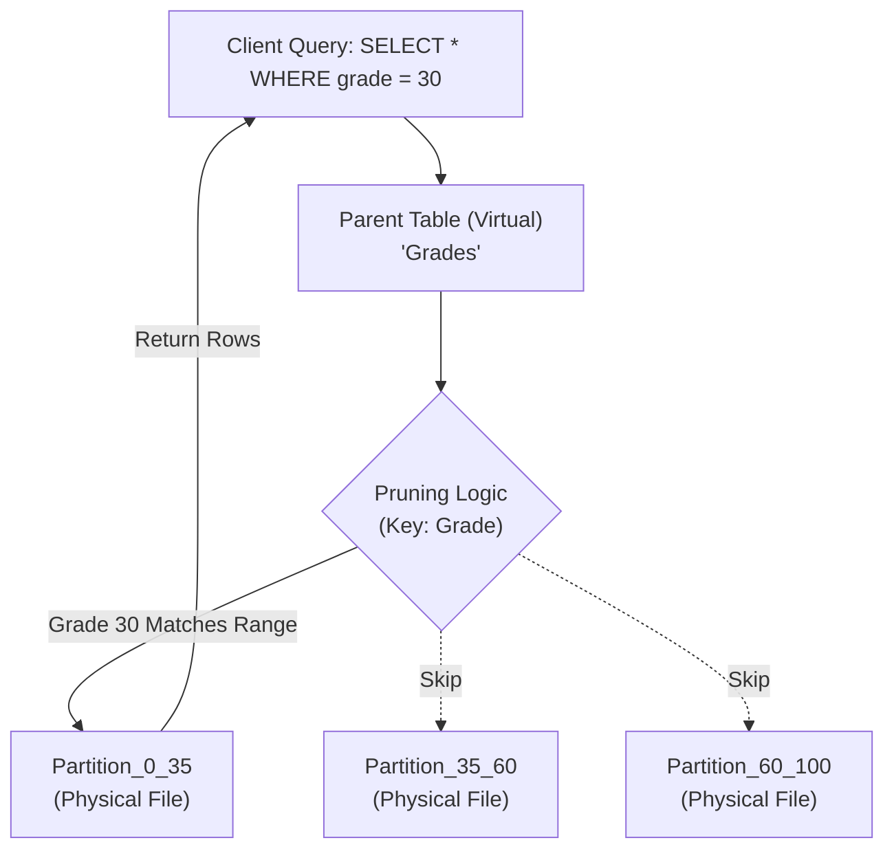

**Design Rationale:**
Partitioning is chosen over a monolithic table to strictly manage **I/O patterns**. By ensuring that queries related to specific ranges (e.g., "Data from 2023") only touch specific files, the system avoids polluting the RAM cache with irrelevant data blocks.

### 3. Configuration Dictionary

| Flag/Command               | Database | Impact of Tuning                                                                                                                               |
| :------------------------- | :------- | :--------------------------------------------------------------------------------------------------------------------------------------------- |
| `PARTITION BY RANGE`       | DDL      | segments data based on a continuous range (e.g., Dates, IDs). Best for time-series.                                                            |
| `PARTITION BY LIST`        | DDL      | Segments data based on discrete values (e.g., Region: 'US', 'EU').                                                                             |
| `PARTITION BY HASH`        | DDL      | Distributes data uniformly using a modulus function. Useful when no natural range exists to prevent hotspots.                                  |
| `enable_partition_pruning` | Postgres | **CRITICAL**. Default `on`. If `off`, the planner scans _every_ partition regardless of the `WHERE` clause, negating all performance benefits. |
| `ATTACH PARTITION`         | DDL      | specific command to link a standalone table as a child of a partitioned table. Allows for near-instant data loading (ETL).                     |

### 4. Trade-off Matrix

| Mechanism                   | Query Latency                       | Maintenance           | Write Cost                | Flexibility | Use Case                                    |
| :-------------------------- | :---------------------------------- | :-------------------- | :------------------------ | :---------- | :------------------------------------------ |
| **Horizontal Partitioning** | **Low** (If Pruned) / High (If not) | Medium (Schema sync)  | Medium (Routing overhead) | Medium      | Time-series data, huge logs ($100M+$ rows). |
| **Vertical Partitioning**   | Low (Specific columns)              | High (Joins required) | Medium                    | Low         | Separating heavy BLOBs/Text from metadata.  |
| **Single Monolithic Table** | Medium (B-Tree depth)               | **Low**               | Low                       | High        | General OLTP under 10M rows.                |
| **Sharding**                | High (Network hops)                 | **Extreme**           | Low (Distributed)         | Low         | Massive scale exceeding single node limits. |

### 5. Production Hardening

- **The Row Movement Trap:** Updating a row's partition key (e.g., changing `grade` from 30 to 60) is **NOT** an in-place update. It is physically a `DELETE` from Partition A and an `INSERT` into Partition B. This doubles I/O, fires triggers twice, and causes index thrashing. **Avoid updating partition keys.**
- **Pruning Failures:** If your query does not include the partition key (e.g., `SELECT * FROM grades WHERE name = 'Hussein'`), the database must scan **all** partitions. This is often slower than scanning a single non-partitioned table due to the overhead of managing multiple open file handles and indexes.
- **Primary Key Constraints:** In many implementations (like Postgres), unique constraints (Primary Keys) must include the partition key. You cannot enforce a global unique ID across partitions without including the partition key in the constraint.
- **Constraint Exclusion:** Ensure `enable_partition_pruning` is strictly enabled. In older versions or specific configs, failing to set this results in "Partition Pruning Failure," where the DB scans petabytes of data for a kilobyte result.

# 6. Database Sharding

### 1. Engineering Context

- **Surpassing Single-Node Write Throughput:** Overcoming the IOPS and CPU saturation limits of a single master node by distributing write operations across distinct physical servers.
- **Index Size Management:** Preventing B+Tree indexes from exceeding RAM capacity (Buffer Pool). By splitting data, indexes remain smaller and cache-resident, preventing disk thrashing.
- **Blast Radius Containment:** Isolating failures so that a crash or corruption in one shard affects only a subset of users (e.g., "European Users") rather than the entire global user base.

### 2. Internals & Architecture (The Deep Dive)

**Logical View:** The application perceives a single monolithic dataset (e.g., `All_Users`).
**Physical View (Network/Disk Level):** Data exists on completely isolated database instances (nodes), potentially in different data centers. The client or middleware MUST determine the routing logic before a TCP connection is even utilized for the query.

**The Sharding Mechanism (Consistent Hashing):**
Instead of `Key % N` (which breaks when `N` changes), use a Hash Ring.

1.  **Ring Generation:** Hash server identifiers (IPs/IDs) to points on a circle.
2.  **Key Mapping:** Hash the Sharding Key (e.g., UserID) to the same circle.
3.  **Routing:** Traverse the ring clockwise to find the first server node. This ensures that adding/removing a node only affects adjacent neighbors, not the entire cluster.

**Costs:**

- **Network:** increased latency if the client/proxy requires a lookup service to find the shard map.
- **Complexity:** Application logic must handle aggregation of results from multiple shards ($O(S)$ where $S$ is number of shards) for non-keyed queries.
- **Consistency:** Loss of ACID guarantees across shards. No atomic commits involving Shard A and Shard B.

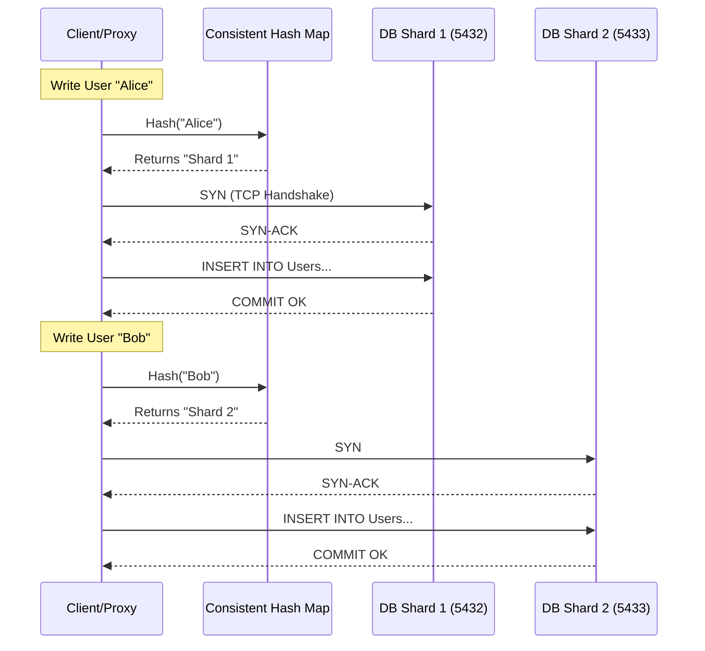

**Design Rationale:**
Sharding is chosen _only_ after vertical scaling, read replicas, and caching layers are exhausted. It moves the complexity of routing and data distribution to the application (or middleware like Vitess) to achieve linear write scalability that a single ACID master cannot provide.

### 3. Configuration Dictionary

| Variable / Concept           | Context            | Impact of Tuning                                                                                                                                                                     |
| :--------------------------- | :----------------- | :----------------------------------------------------------------------------------------------------------------------------------------------------------------------------------- |
| `Shard Key`                  | Schema Design      | **CRITICAL**. Determines data distribution. A poor key (e.g., boolean or low cardinality) causes uneven distribution ("data hotspots"), rendering sharding useless.                  |
| `max_connections`            | Postgres/MySQL     | Must be tuned per shard. Since the app opens connections to _every_ shard, the total open file descriptors on the app server = $Connections \times Shards$. Use Pooling (PgBouncer). |
| `vbuckets` / `virtual_nodes` | Consistent Hashing | usage of virtual nodes in the hash ring improves distribution balance, preventing one physical node from owning too large an arc of the keyspace.                                    |

### 4. Trade-off Matrix

| Mechanism        | Write Scalability            | Read Scalability      | ACID Support                | Complexity  | Use Case                                                             |
| :--------------- | :--------------------------- | :-------------------- | :-------------------------- | :---------- | :------------------------------------------------------------------- |
| **Sharding**     | **Linear** ($O(N)$ nodes)    | High (Scatter-Gather) | **None** (Cross-shard)      | **Extreme** | Global scale apps (YouTube, Twitter) exceeding single master limits. |
| **Replication**  | Low (Single Master limit)    | High (Read Replicas)  | Full (Eventual on replicas) | Low         | Read-heavy workloads (Blogs, standard SaaS).                         |
| **Partitioning** | Low (Single Disk/IOPS limit) | Medium (Pruning)      | Full                        | Medium      | Managing large history tables (Time-series logs).                    |

### 5. Production Hardening

- **Cross-Shard Join Anti-Pattern:** DO NOT attempt to `JOIN` tables living on different shards. The latency is prohibitive ($O(N \times M)$ over network). Denormalize data so all data required for a query lives on the same shard.
- **The "Hot Shard" Problem:** If you shard by a key with high skew (e.g., "Celebrity" user with 100M followers), one shard will take 90% of the traffic while others sit idle. Use composite keys or application-level caching for hot keys.
- **Resharding Complexity:** changing the shard count (e.g., going from 10 to 20 shards) requires moving data. This is a massive, risky IO operation that often degrades performance during the migration. Avoid dynamic resharding; pre-provision heavily.
- **Transaction Boundaries:** Transactions are strictly local to a single shard. If a business action requires updating Shard A and Shard B, you must use eventual consistency (Sagas) or Two-Phase Commit (2PC) at the app level. **Avoid 2PC** if possible due to blocking latency.
- **Scatter-Gather Latency:** Queries without the shard key (e.g., "Find all users named 'John'") must query _all_ shards. The response time is determined by the _slowest_ shard.

# 7. Concurrency Control

### 1. Engineering Context

- **Arbitrating Shared State Access:** Managing simultaneous read/write operations on identical memory or disk segments to prevent data corruption without enforcing global serialization (which destroys throughput).
- **Mitigating Race Conditions:** Solving "Lost Updates" and "Double Booking" scenarios where multiple transactions read a valid state and attempt to state-transition simultaneously based on obsolete data.
- **Balancing Isolation vs. Latency:** Selecting the appropriate locking strategy (Pessimistic vs. Optimistic) to define how much interference transactions can tolerate before blocking or failing.

### 2. Internals & Architecture (The Deep Dive)

**Logical View (Locking Disciplines):**

- **Shared Locks (S-Lock):** Used for reading. Multiple transactions can hold S-Locks on the same resource simultaneously. Prevents any transaction from acquiring an Exclusive Lock.
- **Exclusive Locks (X-Lock):** Used for writing/modifying. Only one transaction can hold an X-Lock. Blocks all other S-Locks and X-Locks. Requires the resource to be free of _any_ locks before acquisition.
- **Two-Phase Locking (2PL):** A protocol ensuring serializability.
  1.  **Expanding Phase:** Transaction acquires all necessary locks. No locks are released.
  2.  **Shrinking Phase:** Transaction releases locks (usually at Commit/Rollback). **Constraint:** Once a lock is released, no new locks can be acquired.

**Physical View (Implementation):**

- **Lock Manager:** An in-memory hash table tracking Lock Objects (Row ID -> Lock State). Maintaining these locks consumes memory proportional to the number of active locks.
- **Wait Queues:** When a transaction is blocked (e.g., requesting X-Lock on an S-Locked row), it enters a Wait Queue inside the OS/Kernel or DB Engine.
- **Deadlock Detector:** A background process (daemon) traversing the "Wait-For" graph looking for cycles ($T1 \to T2 \to T1$). If found, it kills the transaction that created the cycle (or the one with least work done) to break the deadlock.

**Costs:**

- **Memory:** High overhead for maintaining millions of row-level locks in RAM (e.g., Postgres does not escalate locks, increasing RAM usage per lock).
- **CPU:** Cycles spent on spinlocks, traversing Wait-For graphs (Deadlock detection), and managing the Lock Manager hash table.
- **Latency:** Blocked transactions sit idle (Wait Time), increasing tail latency.
- **Context Switches:** High during high-contention periods as threads sleep and wake up upon lock release.

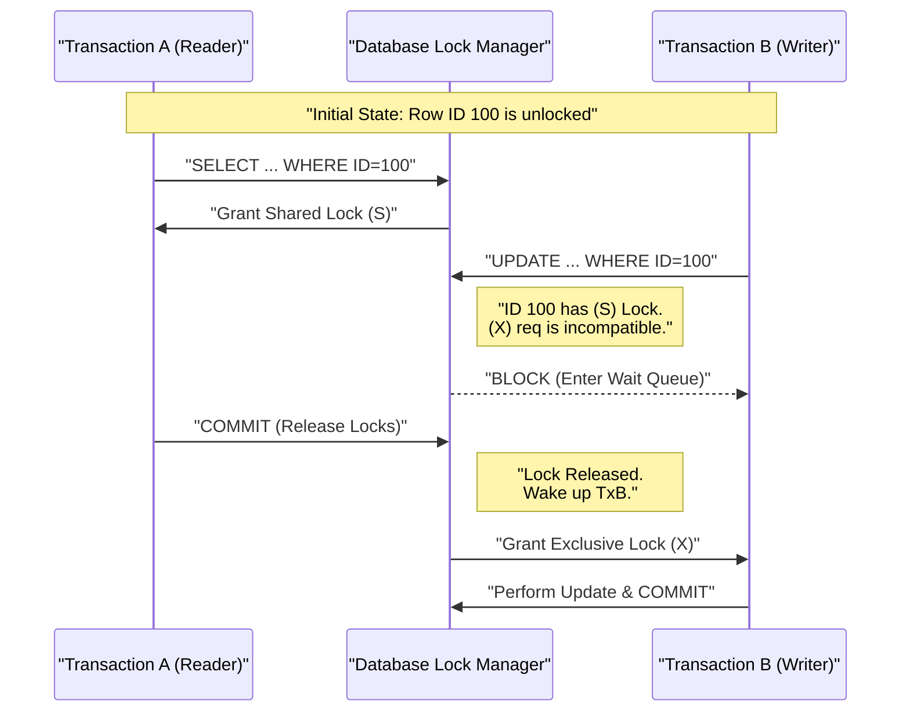

**Design Rationale:**
Two-Phase Locking (2PL) via Pessimistic Concurrency Control was chosen to guarantee **Serializability** and prevent data anomalies. By holding locks until the end of the transaction, the database ensures that no other transaction sees intermediate, inconsistent states, preventing cascading rollbacks at the cost of blocking latency.

### 3. Configuration Dictionary

| Flag/Command                      | Context         | Impact of Tuning                                                                                                                                                                    |
| :-------------------------------- | :-------------- | :---------------------------------------------------------------------------------------------------------------------------------------------------------------------------------- |
| `SELECT ... FOR UPDATE`           | SQL Query       | **CRITICAL**. Explicitly acquires an Exclusive Lock on read. Prevents "Double Booking" by forcing concurrent transactions to wait until the first commits.                          |
| `lock_timeout`                    | System Config   | Sets maximum duration to wait for a lock. Default is often infinite. Set this to fail fast (e.g., 5s) rather than hanging threads indefinitely.                                     |
| `deadlock_timeout`                | Postgres Config | Time to wait before checking for deadlocks. Lower values detect deadlocks faster but burn CPU on the Wait-For graph traversal.                                                      |
| `SET TRANSACTION ISOLATION LEVEL` | Session         | Defines locking strictness. `SERIALIZABLE` locks ranges (Predicate Locks); `REPEATABLE READ` locks read rows; `READ COMMITTED` releases read locks immediately after the statement. |

### 4. Trade-off Matrix

| Mechanism               | Description                                  | Consistency                 | Concurrency (Throughput)       | Failure Mode               | Use Case                                                   |
| :---------------------- | :------------------------------------------- | :-------------------------- | :----------------------------- | :------------------------- | :--------------------------------------------------------- |
| **Pessimistic Locking** | Lock resources before use (`FOR UPDATE`).    | **High** (Guarantees order) | Low (High contention/blocking) | Deadlocks                  | Financial ledgers, Inventory management (Strict ordering). |
| **Optimistic Locking**  | No locks. Check version/timestamp at Commit. | Medium (Snapshots)          | **High** (No blocking)         | Rollback/Retry on conflict | High-read/Low-write apps, NoSQL systems.                   |
| **Serializable**        | Range locks / Strict 2PL.                    | Highest (No Phantoms)       | Lowest (Serial execution)      | Serialization Failure      | Medical records, Supply chain logistics.                   |
| **Read Committed**      | Short-lived Read locks.                      | Low (Non-repeatable reads)  | High                           | Race Conditions            | General web apps, Feeds/Comments.                          |

### 5. Production Hardening

- **The Double Booking Anti-Pattern:** Reading a value (`SELECT is_booked FROM seats`), checking it in the app logic, then updating (`UPDATE seats...`) leads to race conditions. Multiple users will see `is_booked=false` simultaneously. **Fix:** Use `SELECT ... FOR UPDATE` to lock the row during the read phase, strictly serializing the transaction.
- **Deadlock Prevention:**
  - **Consistent Ordering:** Always access resources in the same primary key order across all transactions. If Transaction A updates `(Row 1, Row 2)` and Transaction B updates `(Row 2, Row 1)`, a deadlock is mathematically guaranteed. Force both to update `(Row 1, Row 2)`.
  - **Keep Transactions Short:** Long transactions hold locks longer, drastically increasing the probability of lock contention and deadlocks.
- **Lock Escalation Awareness:** Be aware that some DBs (SQL Server) may promote row locks to page/table locks to save memory, killing concurrency. Postgres does not escalate locks but consumes shared memory per lock.
- **Zombie Transactions:** If a client crashes while holding an Exclusive Lock (before commit/rollback), that row remains inaccessible until the TCP connection times out or the session is killed. Configure application-level timeouts and TCP keepalives.

# 8. Database Replication

### 1. Engineering Context

- **Scaling Read Throughput:** Offloading read-heavy operations (e.g., analytics, reporting, user feeds) from the primary writer node to read-only replicas to prevent CPU/IO saturation on the master.
- **High Availability (HA) & Fault Tolerance:** Minimizing Mean Time To Recovery (MTTR) by maintaining warm standby nodes ready for failover in case of master hardware failure or corruption.
- **Geographic Latency Reduction:** Placing read replicas in specific geographic regions (e.g., US-East, EU-West) to serve local users with lower network latency (RTT), while writes incur the cost of propagation.,

### 2. Internals & Architecture (The Deep Dive)

**Logical View:**
The system consists of one **Master (RW)** node and $N$ **Standby (RO)** nodes. All writes (DML/DDL) must target the Master. The Master streams changes to Standbys.

**Physical View (WAL Streaming):**
Instead of replicating high-level SQL statements (which can be non-deterministic, e.g., `NOW()` or `RAND()`), modern databases (Postgres/MySQL) typically replicate the **Write-Ahead Log (WAL)**.

1.  **Commit on Master:** Client sends `INSERT`. Master writes to its local WAL buffer and flushes to disk.
2.  **WAL Sender:** A background process on the Master streams WAL segments (binary deltas) over a persistent TCP connection to the Standby.
3.  **WAL Receiver:** The Standby receives the segment, acknowledges receipt (if synchronous), and replays the binary changes to its own heap/indexes.

**Costs:**

- **Network:** Bandwidth consumption proportional to write volume.
- **Latency (Sync):** Write latency = Local Disk Fsync + Network RTT + Remote Disk Fsync + Ack.
- **Storage:** Duplication of full dataset across $N$ nodes.

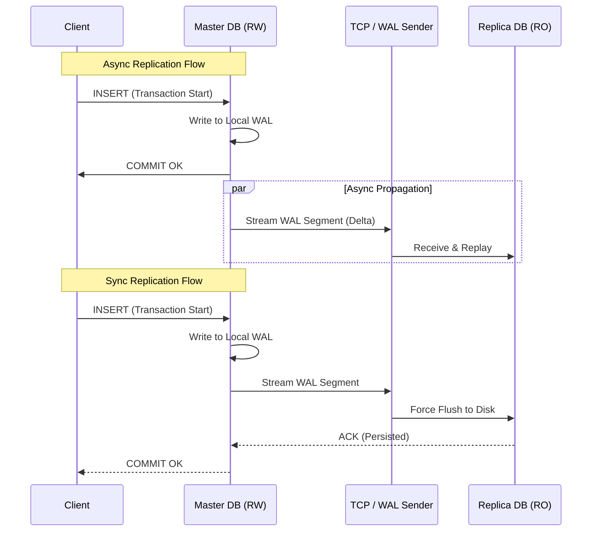

**Design Rationale:**
**Single-Leader Replication** (Master-Standby) is chosen over **Multi-Master** for simplicity. Multi-master introduces complex conflict resolution scenarios (e.g., two nodes updating the same row simultaneously), whereas Single-Leader enforces a strict serial ordering of writes, guaranteeing consistency at the cost of write scalability limits.

### 3. Configuration Dictionary

| Parameter (Postgres context) | Default | Impact of Tuning                                                                                                                                                                                                              |
| :--------------------------- | :------ | :---------------------------------------------------------------------------------------------------------------------------------------------------------------------------------------------------------------------------- |
| `synchronous_commit`         | `on`    | **CRITICAL**. Controls durability vs. latency.  `on`: Waits for WAL flush on local + sync replicas.  `remote_write`: Waits for OS buffer on replica (faster, less durable).  `off`: Async (fastest, data loss risk). |
| `hot_standby`                | `on`    | Enables the replica to accept read-only queries while recovering/replaying WAL logs. If `off`, the replica is essentially a warm backup that cannot be queried.                                                               |
| `primary_conninfo`           | N/A     | Defines the connection string used by the Standby to connect to the Master. Includes host, port, and authentication for the replication user.                                                                                 |
| `synchronous_standby_names`  | Empty   | List of application names (replicas) that the Master _must_ wait for before confirming a commit. Enables Synchronous Replication.                                                                                             |

### 4. Trade-off Matrix

| Mechanism             | Write Latency                  | Read Consistency                                 | Data Durability (RPO)           | Throughput Impact       | Use Case                                         |
| :-------------------- | :----------------------------- | :----------------------------------------------- | :------------------------------ | :---------------------- | :----------------------------------------------- |
| **Async Replication** | Low (Master Local I/O)         | **Eventual** (Replica Lag)                       | Low (Data loss on Master crash) | High Write / High Read  | Social feeds, Logs, Non-financial data.          |
| **Sync Replication**  | High (Network RTT included)    | **Strong** (if reading from Master/Sync Replica) | **Zero Loss**                   | Lower Write / High Read | Financial transactions, Inventory counts.        |
| **Multi-Master**      | Medium (Local write + Bg sync) | Weak (Conflict prone)                            | Medium                          | High Write / High Read  | Geo-distributed writes where conflicts are rare. |

### 5. Production Hardening

- **The "Read Your Own Write" Trap:** In Async replication, a user may update their profile (Write to Master) and immediately reload the page (Read from Replica). Due to replication lag, they see old data.
  - _Mitigation:_ Sticky sessions (route user to Master for $X$ seconds after a write) or force critical reads to Master.
- **Split Brain:** If the network partitions, the Standby might promote itself to Master while the original Master is still active. Clients writing to both cause data divergence.
  - _Mitigation:_ Use consensus algorithms (e.g., Raft/Paxos) or fencing mechanisms (STONITH) to kill the old master.
- **Replication Slot Bloat:** If a Standby falls significantly behind or disconnects, the Master must retain old WAL segments preventing them from being recycled. This can fill up the Master's disk, causing a crash. Monitor WAL size strictly.
- **Cascading Failure (Sync):** If `synchronous_standby_names` is set and the replica goes down, the Master will hang on all commits, halting the entire system. Configure multiple sync standbys or timeout fallbacks.

# 9. System Design Case Studies

### 1. Case Study A: The Social Graph (Twitter Implementation)

**Engineering Context**

- **Modeling Many-to-Many Relationships:** efficiently storing unidirectional relationships (User A follows User B) without creating join-bombs during high-traffic reads.
- **Latency vs. Consistency:** Balancing the requirement to show "Follower Counts" immediately versus the high cost of computing `COUNT(*)` on massive tables.
- **Write Amplification:** Handling "Celebrity" edge cases where a single action (Tweet) requires fan-out to millions of timelines.

**Internals & Architecture (The Deep Dive)**

**Logical View:**
The core entity is the `Following` table, linking `SourceID` (Follower) and `DestinationID` (Followee).

- **Naive Approach:** To get follower count, execute `SELECT COUNT(*) WHERE DestinationID = X`. This triggers a massive Index Scan ($O(N)$ where N is follower count).
- **Optimized Approach:** Denormalize counts onto the `Profile` table. Increment `Profile.following_count` atomically when a row is inserted into the `Following` table.

**Physical View (Disk/OS Level):**

1.  **Index Strategy:** The `Following` table requires a Composite B+Tree Index on `(SourceID, DestinationID)` for "Who am I following?" and `(DestinationID, SourceID)` for "Who follows me?".
2.  **Async Loading:** When rendering a profile, do **not** synchronously query "Am I following this user?". This doubles the I/O requirement for the initial page load. Fetch the Profile data first (1 Page Read), then fetch relationship status asynchronously.

**Costs:**

- **Disk I/O:** High on `INSERT` (updating B+Tree structure). Low on `SELECT` if indexes fit in RAM.
- **CPU:** Context switches increase during lock contention on high-volume profile updates (Celebrity gains 10k followers/sec).

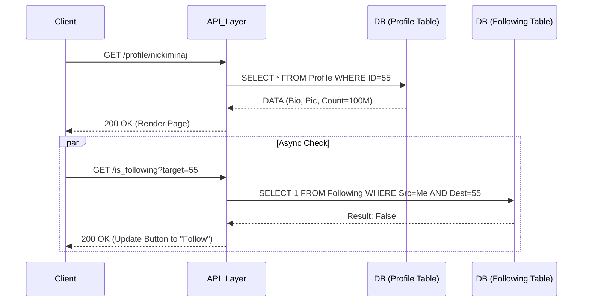

**Design Rationale:**
Separating the "Profile View" from the "Relationship Check" reduces the critical path latency. If the `Following` table is under high write load (locking), the Profile page still renders instantly. Using denormalized counters avoids scanning millions of index leaf nodes for a simple number display.

---

### 2. Case Study B: High-Throughput URL Shortener

**Engineering Context**

- **Write Throughput Saturation:** Handling massive concurrent inserts of new URLs without locking the primary key index.
- **Collision Resolution:** Generating short codes (e.g., `bit.ly/3x9Z`) that are unique without expensive "Check-then-Insert" race conditions.
- **Predictability vs. Security:** Preventing enumeration attacks where attackers guess sequential IDs (`/1`, `/2`, `/3`).

**Internals & Architecture (The Deep Dive)**

**Strategy 1: Database Sequences (The Counter Approach)**

- **Mechanism:** Use Postgres `SERIAL` or Redis `INCR`. Map the Integer ID (Base10) to Base62 (a-z, A-Z, 0-9).
- **Physical:** Append-only B-Tree insertions.
- **Cost:** $O(1)$ insertion. Minimal Index fragmentation (Sequential Writes).
- **Security Risk:** Trivial to enumerate total URL count.

**Strategy 2: Hashing & Collision Handling (The Random Approach)**

- **Mechanism:** MD5/SHA256 the Long URL $\rightarrow$ Take first 7 bytes $\rightarrow$ Base62 Encode.
- **Collision:** If `INSERT` fails (Duplicate Key), salt the input and retry.
- **Physical:** Random insertions into B-Tree causing Page Splits ($O(N)$ data movement) and Buffer Pool thrashing.

**Sharding Strategy (Consistent Hashing):**
To scale beyond a single node, use a Hash Ring.

1.  **Hash(ShortURL)** maps to a specific Shard.
2.  **Write Path:** Client hashes LongURL $\rightarrow$ Determines Shard $\rightarrow$ Writes.
3.  **Read Path:** Client has ShortURL $\rightarrow$ Hashes to find Shard $\rightarrow$ SELECT from specific Shard.

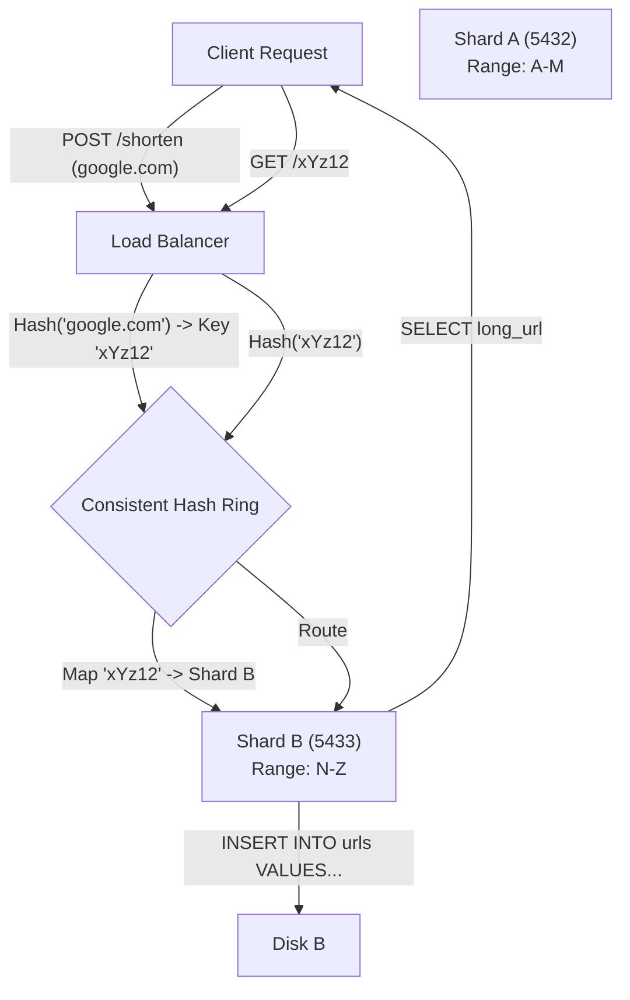

**Design Rationale:**
Sharding is introduced only when a single Write Master cannot handle the IOPS. Consistent Hashing prevents a total cluster rebalance when adding a new node; only $K/N$ keys need to move (where $K$ is keys, $N$ is nodes).

### 3. Configuration Dictionary

| Parameter         | Context         | Impact of Tuning                                                                                                                                                                                                    |
| :---------------- | :-------------- | :------------------------------------------------------------------------------------------------------------------------------------------------------------------------------------------------------------------ |
| `max_connections` | Postgres Config | Defines connection limit. **Critical:** Use a Connection Pool (PgBouncer) to keep active DB connections low (e.g., 50-100) while serving thousands of HTTP requests. High values consume kernel RAM per connection. |
| `fillfactor`      | Index Config    | Set to <100% (e.g., 70%) for Random ID tables (Strategy 2) to reduce Page Splits on insert.                                                                                                                         |
| `wal_level`       | Replication     | Set to `replica` or `logical` to enable read-replicas for scaling URL redirection (Read-Heavy workload).                                                                                                            |

### 4. Trade-off Matrix: ID Generation Strategies

| Strategy                         | Write Latency                   | Index Health                    | Security                 | Scale Capability    | Use Case                                                                         |
| :------------------------------- | :------------------------------ | :------------------------------ | :----------------------- | :------------------ | :------------------------------------------------------------------------------- |
| **Auto-Increment (Serial)**      | **Lowest** (Sequential I/O)     | High (No fragmentation)         | Low (Predictable)        | Single Master Limit | Internal tools, non-public links.                                                |
| **Random Hash (MD5/UUID)**       | High (Random I/O + Retry loops) | Low (Page Splits/Fragmentation) | **High** (Unpredictable) | Shard-friendly      | Public URL shorteners (Bitly).                                                   |
| **Key Generation Service (KGS)** | Medium (Network hop to KGS)     | High                            | High                     | High                | Distributed systems requiring unique IDs without DB coordination (Snowflake ID). |

### 5. Production Hardening

- **The Double Booking/Race Condition:**
  - _Scenario:_ Two users try to claim custom alias "amazon" simultaneously.
  - _Fix:_ Do **not** `SELECT` then `INSERT`. Use `INSERT` with `ON CONFLICT DO NOTHING`. Rely on the Database constraints to enforce uniqueness atomically.
- **Thundering Herd on Cache Miss:**
  - _Scenario:_ A celebrity tweets a link. Millions click. Redis Cache misses. All requests hit the DB simultaneously.
  - _Fix:_ Implement **Request Coalescing** (Singleflight) in the application layer. Only _one_ DB query goes out; all other concurrent requests wait for that specific result.
- **Write Amplification with UUIDs:**
  - _Anti-Pattern:_ Using Random UUIDv4 as a Primary Key in MySQL (Clustered Index). This forces the engine to load random pages from disk to insert rows, destroying Buffer Pool efficiency. Use sequential IDs (ULID) or Postgres (Heap-based).

# 10. Pluggable Database Engines

### 1. Engineering Context

- **Decoupling Logic from Persistence:** Separating the database management system (networking, SQL parsing, optimization) from the underlying storage mechanism (disk I/O, file format) allows for workload-specific optimization.
- **Optimizing for Hardware Characteristics:** Selecting engines that align with physical storage properties (e.g., using Log-Structured Merge trees for SSDs to minimize random write amplification vs. B+Trees for spinning disks).
- **Workload Isolation:** Enabling a single database instance to handle heterogeneous workloads (e.g., a table for high-throughput logging using RocksDB alongside a table for transactional banking using InnoDB).

### 2. Internals & Architecture (The Deep Dive)

**Logical View:** The Database Management System (DBMS) acts as the frontend. It handles client TCP connections, authentication, and SQL parsing. It essentially says "Store this tuple" or "Fetch this row."

**Physical View (The Engine):** The Engine is a library invoked by the DBMS to manipulate bytes on the disk.

- **B-Tree Engines (InnoDB, MyISAM):** Organize data in fixed-size pages (e.g., 16KB). Updates are in-place modifications of these pages.
- **LSM Engines (RocksDB, LevelDB):** Organize data as a log. Writes go to an in-memory `MemTable`. When full, it flushes to disk as an immutable `SSTable`. Background compaction merges these files.

**Costs:**

- **B-Tree Costs:** High Random I/O on writes (Page Splits). Low CPU on reads.
- **LSM Costs:** Low I/O on writes (Append-only). High CPU during Compaction cycles. High Read Amplification (checking multiple SSTables).

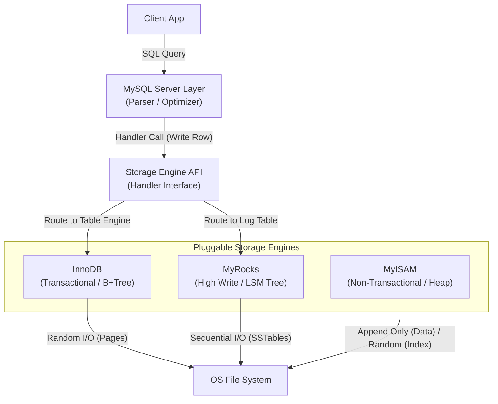

**Design Rationale:**
MySQL adopted this architecture to allow users to "swizzle" the engine based on the table's purpose. You are not locked into a single data structure for the entire dataset. You can use MyISAM for read-heavy non-critical data, InnoDB for critical ACID compliance, and RocksDB for massive write-heavy logs.

### 3. Configuration Dictionary

| Parameter/Command          | Context | Impact of Tuning                                                                                                                   |
| :------------------------- | :------ | :--------------------------------------------------------------------------------------------------------------------------------- |
| `ENGINE=`                  | SQL DDL | Defined at table creation (e.g., `CREATE TABLE t1 (...) ENGINE=InnoDB`). Determines the underlying data structure and file format. |
| `show engines`             | System  | Lists available engines (InnoDB, MyISAM, CSV, Memory, etc.) and their support status.                                              |
| `innodb_buffer_pool_size`  | InnoDB  | **CRITICAL**. Defines how much RAM is dedicated to caching B+Tree pages. Ideally 70-80% of system RAM for a dedicated DB server.   |
| `rocksdb_block_cache_size` | MyRocks | Defines RAM for caching uncompressed data blocks in LSM trees. Tuning this balances read performance against memory usage.         |

### 4. Trade-off Matrix

| Engine      | Data Structure      | Transactional (ACID) | Locking Granularity | Write Cost                            | Read Cost                                  | Use Case                                                       |
| :---------- | :------------------ | :------------------- | :------------------ | :------------------------------------ | :----------------------------------------- | :------------------------------------------------------------- |
| **InnoDB**  | Clustered B+Tree    | **Yes**              | **Row Level**       | Medium (Random I/O on large datasets) | **Low** (Point lookup $O(\log N)$)         | General OLTP, Financial systems, Default choice.               |
| **MyISAM**  | Heap + B-Tree Index | No                   | **Table Level**     | Low (Append-only data)                | Low (Direct pointer)                       | Read-heavy/Legacy apps. **Anti-pattern** for high concurrency. |
| **RocksDB** | LSM Tree            | Yes                  | Row Level           | **Lowest** (Sequential I/O)           | Medium (Key might exist in multiple files) | High-volume write ingestion (Logs, IoT), SSD optimization.     |
| **CSV**     | Text File           | No                   | Table Level         | Low                                   | High (Parsing overhead)                    | Data interchange with Excel/Spreadsheets.                      |
| **Memory**  | Hash / B-Tree       | No (Volatile)        | Table Level         | Zero (No Disk I/O)                    | Lowest                                     | Temporary tables, ephemeral caches.                            |

### 5. Production Hardening

- **MyISAM Corruption Risk:** MyISAM tables are not crash-safe. A power loss during a write often corrupts the index, requiring a manual `REPAIR TABLE` operation which locks the table for hours on large datasets. **Avoid MyISAM for write-heavy workloads.**
- **The UUID Insert Killer (InnoDB):** Do not use random UUIDs as Primary Keys in InnoDB. Since InnoDB organizes the table as a B+Tree clustered by PK, random inserts cause massive page splitting and random I/O, destroying Buffer Pool efficiency. Use `MyRocks` (LSM) if you must use random write patterns, or use sequential IDs in InnoDB.
- **Table-Level Locking Bottlenecks:** MyISAM locks the _entire table_ for a write. Even if you update one row, no other connection can write (and often read) from that table. This creates a massive concurrency bottleneck. Use InnoDB for row-level locking.
- **SSD vs. HDD Selection:** B+Trees (InnoDB) degrade faster on HDDs due to random seek latency. LSM Trees (RocksDB) perform significantly better on SSDs but punish HDDs during compaction phases. align your engine choice with your physical storage hardware.

# 11. Database Cursors

### 1. Engineering Context

- **Preventing Client OOM:** Mitigating "Out of Memory" crashes when an application attempts to load a result set (e.g., 10M rows) that exceeds available heap space.
- **Optimizing Time-to-First-Byte (TTFB):** Enabling stream processing of results. The application can process the first 100 rows while the database continues calculating/retrieving the rest, rather than waiting for the full dataset compilation.
- **Network Bandwidth Control:** Smoothing network spikes by fetching data in chunks (batching) rather than saturating the TCP window with a massive single-shot bulk transfer.

### 2. Internals & Architecture (The Deep Dive)

**Logical View:**
A Cursor is a stateful pointer to a specific location within a query result set, living inside a database transaction.

- **Client-Side Cursor (Default):** The driver issues `SELECT *`. The DB pushes _all_ data to the client's network buffer immediately. The "cursor" logic is merely iterating over the local buffer.
- **Server-Side Cursor:** The client issues `DECLARE CURSOR`. The DB plans the query but halts execution (or pauses transmission). Data is only transmitted when the client issues `FETCH n`.

**Physical View (Postgres/Network Level):**

1.  **Initialization:** The client sends `BEGIN` followed by `DECLARE cursor_name CURSOR FOR query`. The DB creates a "Portal" object in memory (pinned to the session).
2.  **Retrieval:** The client sends `FETCH 1000 FROM cursor_name`.
3.  **Execution:** The DB engine executes the plan just enough to find the next 1000 tuples. If the plan involves a Sort, the DB might compute the sort fully (spilling to disk/`work_mem` if needed) before returning the first batch.
4.  **State Management:** The transaction remains open. In MVCC databases (Postgres), this holds a snapshot, preventing cleanup of old row versions (Dead Tuples) by processes like Vacuum.

**Costs:**

- **Network RTT:** **High**. Every batch requires a round trip (`FETCH` -> `Data`).
- **DB Memory:** **High**. The connection and transaction state must be maintained for the duration of the entire processing time.
- **Client Memory:** **Low**. Only needs to hold `batch_size` rows.
- **Disk I/O:** Varies. If using Index Scans, I/O is spread out. If using Sort/Hash Aggregates, temp files may be written to disk immediately.

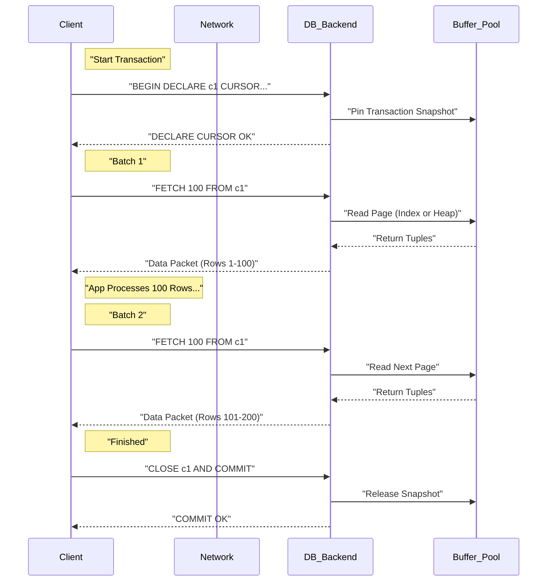

**Design Rationale:**
Server-side cursors were designed to decouple **Query Execution** from **Result Transmission**. Without them, a 1GB result set requires 1GB of buffer space on the client (or kernel socket buffers), forcing the DB to block on network I/O if the client consumes data slowly. Cursors shift the backpressure handling to the application logic.

### 3. Configuration Dictionary

| Flag/Parameter            | Context            | Impact of Tuning                                                                                                                                                                |
| :------------------------ | :----------------- | :------------------------------------------------------------------------------------------------------------------------------------------------------------------------------ |
| `cursor_tuple_fraction`   | Postgres Config    | Default 0.1. Tells the optimizer to optimize for retrieving the first N rows (fast start) rather than the total result set. Helping it choose Index Scans over Seq Scans.       |
| `FETCH_SIZE` / `itersize` | Client Driver      | Defines the batch size (e.g., 2000). Too small = High Network RTT overhead. Too large = Client Memory pressure.                                                                 |
| `no_cursor_timeout`       | MongoDB            | Prevents the server from killing idle cursors (default 10 mins). Critical for long processing tasks.                                                                            |
| `holdable`                | Cursor Declaration | `DECLARE c1 CURSOR WITH HOLD`. Allows the cursor to remain open _after_ the transaction commits. **Expensive**: Forces DB to materialize the full result set into temp storage. |

### 4. Trade-off Matrix

| Mechanism              | Latency (First Byte)          | Latency (Total)         | Client Memory        | DB Resource Impact                            | Use Case                                                  |
| :--------------------- | :---------------------------- | :---------------------- | :------------------- | :-------------------------------------------- | :-------------------------------------------------------- |
| **Client-Side Cursor** | Medium (Wait for execution)   | **Low** (Bulk Transfer) | **High** (All rows)  | Low (Short transaction duration)              | Small/Medium datasets (<10k rows).                        |
| **Server-Side Cursor** | **Low** (Stream immediately)  | High (RTT per batch)    | **Low** (Batch size) | **High** (Long-running Tx + Snapshot holding) | ETL Jobs, Exporting 1M+ rows, Memory-constrained clients. |
| **Offset/Limit**       | High ($O(N)$ scan)            | Very High               | Low                  | High (Repeated re-scan of discarded rows)     | **Anti-Pattern** for deep paging. Web UI pagination only. |
| **Keyset Pagination**  | **Lowest** ($O(\log N)$ seek) | Low                     | Low                  | Low                                           | Stateless web pagination (Infinite Scroll).               |

### 5. Production Hardening

- **The "Vacuum Block" Anti-Pattern:** In MVCC databases (Postgres), an open transaction (required for a cursor) holds a snapshot. This prevents the auto-vacuum daemon from cleaning up _any_ dead tuples in the entire database updated after that snapshot started. **Result:** Massive table bloat and performance degradation during long ETL jobs.
  - _Fix:_ Commit frequently or use `WITH HOLD` (carefully) to detach from the transaction.
- **Cursor Leaks:** If the application crashes or exceptions occur without a `finally` block to `CLOSE` the cursor and `COMMIT/ROLLBACK`, the database connection remains stuck in a "Idle in transaction" state, holding locks and memory resources.
- **Network Timeouts:** If the client takes 5 minutes to process a batch, the database or intermediate firewalls/load balancers may kill the TCP connection due to inactivity (`idle_transaction_session_timeout`).
  - _Fix:_ Implement keep-alives or process data in a separate thread from the fetcher.
- **N+1 Fetch Problem:** Setting the fetch size to 1 (fetching row-by-row) generates network traffic orders of magnitude higher than the data size due to packet headers and protocol overhead. **Always batch.**

# 12. NoSQL Architecture

### 1. Engineering Context

- **Decoupling Storage from API:** Moving away from the rigid "Table/Row" structure to allow the storage engine (e.g., LSM Trees, B-Trees) to treat data as raw bytes, while the API layer interprets format (JSON, Graph, Key-Value).
- **Scaling Horizontal Writes:** Overcoming the limitations of a single ACID master by distributing data partitions across multiple nodes (Sharding), accepting eventual consistency in exchange for high write throughput,.
- **Optimizing Data Locality:** Storing related data (aggregates) together in a single "Document" to minimize I/O depth, avoiding expensive JOINs required in normalized relational models.

### 2. Internals & Architecture (The Deep Dive)

**Logical View:**
NoSQL systems separate the **Data Format** (API layer) from the **Storage Engine**. The engine manages pages and bytes; the frontend manages Documents or Key-Values.

**Physical View (MongoDB Evolution Case Study):**

1.  **Legacy (MMAPv1):** Used linked lists and offset-based pointers. Required a **Global Lock** (or Collection Lock), severely limiting concurrency. Modifications to document size required rewriting files to new offsets,.
2.  **Modern (WiredTiger):** Introduced **Document-Level Locking** and Compression.
    - **Pre-5.3 (Non-Clustered):** Uses a **Hidden Index** mapping a 64-bit `RecordID` to the physical document. The visible `_id` index points to this `RecordID`.
    - **Cost:** Lookup requires **Two B-Tree Traversals** ($O(\log N) + O(\log N)$): One on `_id` index $\rightarrow$ get `RecordID` $\rightarrow$ search Hidden Index $\rightarrow$ get Document.
3.  **Clustered Collections (5.3+):** The table _is_ the B-Tree ordered by `_id`.
    - **Optimization:** Lookup is **One B-Tree Traversal** ($O(\log N)$). Data lives in the leaf nodes of the `_id` index.
    - **Cost:** Secondary indexes must point to the full `_id` (12 bytes) instead of the small `RecordID` (8 bytes), increasing storage size if `_id` is large,.

**Redis Internals (In-Memory Key-Value):**

- **Threading:** Single-threaded event loop for command execution to avoid context switching and locking overhead. Uses background threads for heavy I/O (persistence),.
- **Persistence:**
  - **RDB (Snapshotting):** Forks a process to dump memory to disk. Fast reads, potential data loss on crash.
  - **AOF (Append Only File):** Logs every write command sequentially. Slower replay, higher durability.

```mermaid
flowchart TD
    subgraph "MongoDB Lookup (Pre-5.3 / Non-Clustered)"
    Client1["Client"] --> ID_Index["_id Index (B-Tree)"]
    ID_Index -- "Found Key" --> RID["Returns RecordID (8 bytes)"]
    RID --> Hidden_Index["Hidden Index (B-Tree)"]
    Hidden_Index -- "Seek RecordID" --> Page["Data Page (Compressed)"]
    end

    subgraph "MongoDB Lookup (Clustered Collection)"
    Client2["Client"] --> Clustered_Index["_id Clustered Index"]
    Clustered_Index -- "Single Traversal" --> Data["Leaf Node (Full Document)"]
    end

    style Hidden_Index fill:#f9f,stroke:#333,stroke-width:2px
    style Clustered_Index fill:#bbf,stroke:#333,stroke-width:2px
```

**Design Rationale:**
The shift to **Clustered Collections** in document stores (like MongoDB) mimics the MySQL InnoDB architecture to reduce random I/O. By storing the document in the leaf node of the primary index, the engine eliminates the "double lookup" penalty, prioritizing read latency over the flexibility of heap-organized tables,.

### 3. Configuration Dictionary

| Parameter          | System    | Impact of Tuning                                                                                                                                                                  |
| :----------------- | :-------- | :-------------------------------------------------------------------------------------------------------------------------------------------------------------------------------- |
| `clusteredIndex`   | MongoDB   | **CRITICAL**. Boolean flag at collection creation. If `true`, organizes data by `_id`. Reduces lookup cost by 50% (Single B-Tree seek) but increases Secondary Index size,.       |
| `appendonly`       | Redis     | Default `no`. Set to `yes` to enable AOF persistence. Trades write latency (disk sync) for durability. If disabled, data exists only in RAM.                                      |
| `slab_chunk_max`   | Memcached | Controls memory page splitting. If items are slightly larger than the chunk size, significant memory fragmentation ("Slab Waste") occurs. Tune to match object size distribution. |
| `maxmemory-policy` | Redis     | Defines eviction strategy (e.g., `allkeys-lru`). If set incorrectly, writes fail when RAM is full. Essential for using Redis as a cache vs. a database.                           |

### 4. Trade-off Matrix

| Feature         | Relational (SQL)           | Document (NoSQL)                      | Key-Value (Redis/Memcached) | Use Case                                      |
| :-------------- | :------------------------- | :------------------------------------ | :-------------------------- | :-------------------------------------------- |
| **Schema**      | Rigid (Schema-on-Write)    | Flexible (Schema-on-Read)             | None (Blob/String)          | Rapid prototyping vs. Data Integrity.         |
| **Consistency** | Strong (ACID)              | Tunable/Eventual                      | Atomic (Per Key)            | Financial transactions vs. Social Feeds.      |
| **Joins**       | Efficient (Server-side)    | **Expensive/Manual** ($O(N)$ lookups) | Impossible                  | Analytics vs. High-throughput simple lookups. |
| **Write Cost**  | High (B-Tree splits + WAL) | Low (LSM Append-only / RAM)           | Lowest (RAM)                | System of Record vs. Ephemeral State/Cache.   |
| **Locking**     | Row-Level                  | Document-Level                        | Key-Level (Single Threaded) | High concurrency updates.                     |

### 5. Production Hardening

- **UUID as Primary Key Anti-Pattern:** In Clustered Collections (MongoDB/MySQL), using random UUIDs causes random insertions into the B-Tree. This triggers expensive **Page Splits** ($O(N)$ data movement) and destroys Buffer Pool locality. Use sequential IDs (ObjectId/ULID),.
- **The "Double Lookup" Penalty:** In non-clustered MongoDB collections, every query by `_id` performs two distinct B-Tree walks. For read-heavy workloads, migrate to Clustered Collections to halve the I/O operations.
- **Unbounded Keys:** In Redis/Memcached, avoid keys/values that grow indefinitely (e.g., appending to a list). Fetching a 10MB object blocks the single execution thread, causing a "Stop-the-World" latency spike for all other clients.
- **NoSQL "Joins":** Do not simulate Joins in the application layer by iterating a list of IDs and querying the DB for each (`N+1` problem). This saturates the network RTT. Denormalize data or use `$lookup` (with caution regarding memory limits).
- **Memcached Fragmentation:** Memcached allocates memory in fixed-size chunks (Slabs). Storing a 90-byte item in a 100-byte chunk wastes 10 bytes permanently. Monitor Slab Class statistics to tune chunk sizes to your data profile.

# 13. Database Security

### 1. Engineering Context

- **Mitigating Man-in-the-Middle (MITM) Attacks:** Transitioning database wire protocols from default plaintext TCP (vulnerable to packet sniffing via tools like Wireshark) to encrypted streams using TLS/SSL.
- **Enforcing Least Privilege Principle:** Preventing privilege escalation by decoupling Schema Owners (DDL) from Application Users (DML) to contain the blast radius of potential SQL injections.
- **Data-in-Use Protection:** Addressing the limitation where data must be decrypted in RAM to be processed, potentially exposing it to comprised servers or untrusted cloud providers (addressed via Homomorphic Encryption).

### 2. Internals & Architecture (The Deep Dive)

**Logical View (The TLS Upgrade):**
Most databases (Postgres, MySQL) operate on a "Request-Response" model over TCP. Security is often an add-on negotiation.

1.  **Cleartext Start:** The client initiates a TCP connection.
2.  **SSLRequest:** In Postgres, the client sends a special packet asking "Do you speak SSL?"
3.  **Negotiation:** The server responds with `S` (Yes) or `N` (No).
4.  **TLS Handshake:** If `S`, the standard TLS handshake ensues (ClientHello, ServerHello, Certificate Exchange, Key Generation).
5.  **Authentication:** Only _after_ the channel is encrypted does the database request credentials (e.g., MD5 or SCRAM hash).

**Physical View (Certificates & Keys):**
The database server requires a **Public Certificate** (`server.crt`) presented to clients and a **Private Key** (`server.key`) used to decrypt the pre-master secret. The file system permissions on the Private Key must be restricted (e.g., `chmod 600`), or the database process will refuse to start.

**Costs:**

- **Latency:** High during connection establishment (TCP Handshake + TLS Handshake + Auth RTT). Connection Pooling is mandatory to amortize this cost.
- **CPU:** Encryption/Decryption consumes cycles on both client and database server.
- **Network:** TLS records add slight byte overhead.

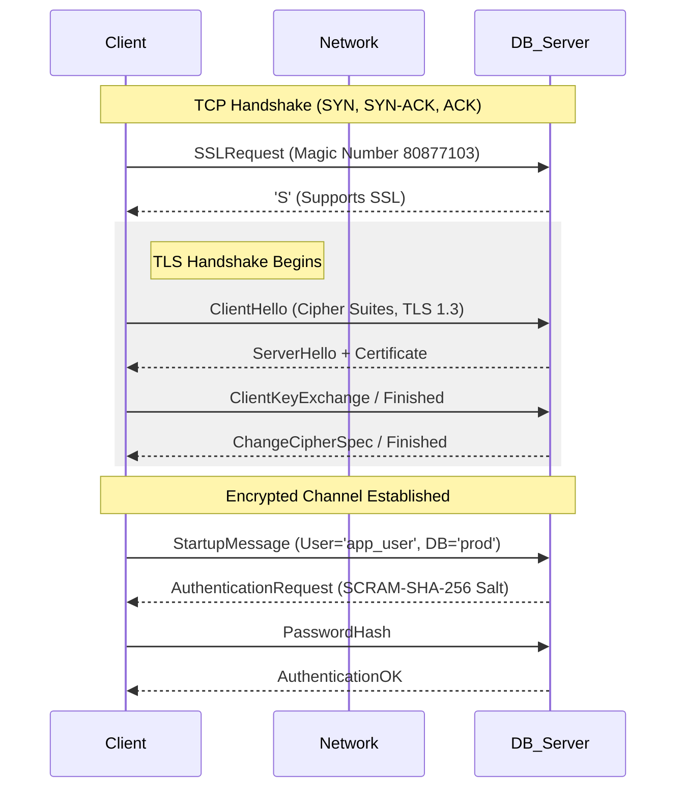

**Design Rationale:**
The "Upgrade" architecture was chosen to support legacy clients on the same port. The server waits for the client to request encryption. However, this allows for "SSL Stripping" attacks if the client is not configured to _require_ SSL (`sslmode=require/verify-full`).

**Homomorphic Encryption (Future State):**
Allows operations (addition, multiplication) on encrypted data _without_ decryption.

- **Mechanism:** Client encrypts $A$ and $B$. Server computes $A+B$ on ciphertexts. Result is encrypted $C$. Client decrypts $C$.
- **Current State:** Extremely slow (minutes for small searches), not production-ready, but eliminates the need for trusted servers.

### 3. Configuration Dictionary

| Flag/Parameter        | Database   | Impact of Tuning                                                                                                     |
| :-------------------- | :--------- | :------------------------------------------------------------------------------------------------------------------- |
| `ssl`                 | Postgres   | Default `off`. Set to `on` to enable TLS. Requires `ssl_cert_file` and `ssl_key_file` to be set.                     |
| `ssl_ciphers`         | Global     | Defines allowed encryption algorithms. Remove weak ciphers (e.g., RC4, MD5) to prevent downgrade attacks.            |
| `password_encryption` | Postgres   | Default `md5` (legacy). Switch to `scram-sha-256` for stronger hashing and protection against rainbow table attacks. |
| `PGSSLMODE`           | Client Lib | `require`: Fails if no SSL. `verify-full`: Verifies server hostname against cert (prevents MITM).                    |
| `-U 0` (UDP Disable)  | Memcached  | **CRITICAL**. Disable UDP listener to prevent Reflection DDoS attacks where the server is used as an amplifier.      |

### 4. Trade-off Matrix

| Mechanism          | Security Level           | Latency Impact              | Throughput Impact              | Use Case                                                                     |
| :----------------- | :----------------------- | :-------------------------- | :----------------------------- | :--------------------------------------------------------------------------- |
| **Plaintext**      | None (Sniffable)         | Lowest                      | Highest                        | Localhost dev; trusted VPC (Not recommended).                                |
| **TLS/SSL**        | High (Encrypted Transit) | Medium (Handshake overhead) | Low (Symmetric crypto is fast) | Standard Production Web Apps.                                                |
| **SCRAM-SHA-256**  | High (Auth)              | Medium (Compute intense)    | Negligible                     | Storing passwords; replacing MD5.                                            |
| **Homomorphic**    | **Extreme** (Zero Trust) | **Extreme** (Minutes/query) | **Extreme**                    | Highly sensitive data processing (Medical/Gov) where slowness is acceptable. |
| **Pool-per-Route** | High (Granular Access)   | Low (Pre-warmed)            | Medium (Resource usage)        | Microservices needing specific permissions (Read vs Write).                  |

### 5. Production Hardening

- **Superuser Anti-Pattern:** Never connect your application as `postgres` or `root`. If an SQL injection occurs, the attacker can `DROP TABLE` or `DROP DATABASE`. Create specific users (`app_read`, `app_write`) with minimum required `GRANT` permissions.
- **Sequence Permission Errors:** When creating a new user with `INSERT` permissions, you must also `GRANT USAGE` on the associated `SEQUENCE`. Otherwise, inserts will fail when trying to generate the next Primary Key ID.
- **SQL Injection via Concatenation:** Never concatenate strings for queries (e.g., `'SELECT * FROM users WHERE name = ' + userInput`). Always use **Parameterized Queries** (e.g., `$1`, `?`) so the database engine treats input as data, not executable code.
- **Memcached UDP Reflection:** By default, older Memcached versions listen on UDP. Attackers can spoof a target's IP, send a small request to Memcached, and Memcached will flood the target with a massive response (Amplification). **Disable UDP**.
- **Connection Pooling Security:** Instead of one pool with `admin` rights, maintain separate pools: one for `READ` (connected as read-only user) and one for `WRITE` (connected as write-user). This enforces security at the infrastructure level.
  Protocol Loaded.

# 14. Homomorphic Encryption

### 1. Engineering Context

- **Closing the "Data-in-Use" Gap:** Traditional encryption protects data at Rest (Disk) and in Transit (TLS), but data must historically be decrypted in RAM to be processed (queried/analyzed), exposing it to memory dumps or comprised host operating systems.
- **Eliminating TLS Termination Risks:** Enabling Layer 7 proxies and load balancers to route traffic based on encrypted payloads without requiring possession of the server's Private Key, enforcing a true Zero-Trust architecture.
- **Untrusted Compute Environments:** allowing execution of analytics and queries on sensitive datasets (e.g., medical or financial records) hosted on public clouds without ever revealing the underlying plaintext to the cloud provider.

### 2. Internals & Architecture (The Deep Dive)

**Logical View:**
Homomorphic encryption allows arithmetic operations (addition, multiplication) to be performed directly on ciphertext.

1.  **Encryption:** Client encrypts value $A$ into $E(A)$.
2.  **Operation:** Server receives $E(A)$ and performs operation $+ 3$. The CPU executes complex polynomial math on the ciphertext.
3.  **Result:** The result is $E(A+3)$. The server does not know what $A$ is or what the result is.
4.  **Decryption:** Client receives $E(A+3)$ and decrypts it to get the integer result.

**Physical View (Compute Level):**
Unlike standard ALU operations which take nanoseconds ($O(1)$), homomorphic operations involve massive lattice-based cryptography overhead. A simple search on 48 rows can take ~2 minutes on standard hardware.

**Costs:**

- **CPU:** **Extreme**. Operations are orders of magnitude slower than plaintext arithmetic.
- **Memory:** Ciphertext expansion can increase data size significantly compared to plaintext.
- **Latency:** Currently prohibits synchronous/interactive user experiences (e.g., logging in or instant search).

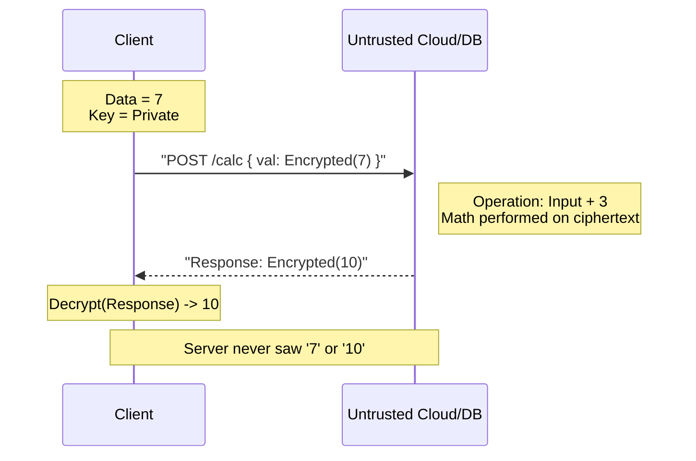

**Design Rationale:**
This architecture is chosen specifically for **Privacy-Preserving Analytics**. It bypasses the need to trust the infrastructure provider. It is not designed for performance; it is designed for mathematical guarantees of privacy during computation.

### 3. Configuration Dictionary

_Note: As this is an emerging technology (e.g., IBM HElib), configurations refer to library/toolkit setups rather than standard DB flags._

| Parameter/Tool   | Context     | Impact of Tuning                                                                                                                                     |
| :--------------- | :---------- | :--------------------------------------------------------------------------------------------------------------------------------------------------- |
| `HE_LIBRARY`     | Build Time  | Selection of library (IBM HElib, Microsoft SEAL). Determines available schemes (BFV, CKKS) and performance characteristics.                          |
| `SECURITY_LEVEL` | Encryption  | Defines bit-strength (e.g., 128-bit). Higher security levels exponentially increase computation time and ciphertext size.                            |
| `Docker`         | Environment | Used to containerize the toolkit environments (e.g., CentOS/Ubuntu) to standardize the massive dependency chains required for compiling C++ HE code. |

### 4. Trade-off Matrix

| Mechanism                         | Privacy Level                 | Latency (Read/Write)        | Throughput | Infrastructure Trust                  | Use Case                                                |
| :-------------------------------- | :---------------------------- | :-------------------------- | :--------- | :------------------------------------ | :------------------------------------------------------ |
| **Standard Encryption (AES/TLS)** | Medium (Decrypted in RAM)     | Low (Hardware acceleration) | High       | **Required** (Must trust admin/cloud) | General Web Apps, standard OLTP.                        |
| **Homomorphic Encryption**        | **Highest** (Never decrypted) | **Extreme** (Minutes/query) | **Low**    | Zero Trust                            | Medical research, Voting systems, Outsourced analytics. |
| **Tokenization**                  | High (Refers to data)         | Low                         | High       | Medium (Token vault is SPF)           | PCI/DSS Credit Card storage.                            |

### 5. Production Hardening

- **Synchronous Path Anti-Pattern:** **DO NOT** use Homomorphic Encryption for user-facing, synchronous requests (e.g., "Search for my tweets"). A search over just 48 records can take minutes. This will timeout any standard HTTP client.
- **Asynchronous Workflows Only:** Use HE for background jobs where latency is irrelevant, such as generating daily trend reports or aggregating sensitive voting data.
- **Key Management Lifecycle:** The security of the entire system rests solely on the client-side keys. If the client key is lost, the data in the cloud is permanently irretrievable garbage.
- **Data Integrity:** Since the server cannot validate the data (it can't read it), you must implement client-side validation or append cryptographic signatures (HMAC) to ensure the server hasn't been fed malicious inputs to process.
